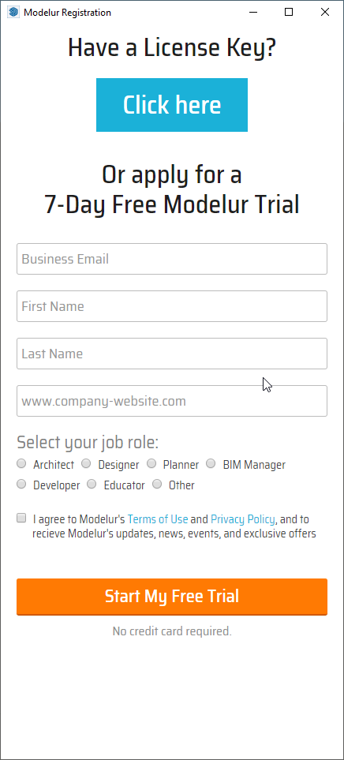

System requirements
-------------------

In order to run Modelur, you will need:

1. <a href="http://www.sketchup.com" target="_blank">SketchUp</a> 2014 or above,
1. Internet Explorer 10 or above (Windows) / Safari 5 or above (OS X).

Modelur works well with both, Make (free) and Pro (commercial) versions of SketchUp.

Installation
------------

There are several ways you can install Modelur:

* Using universal <a href="http://download.modelur.com" target="_blank">.rbz</a> installer.
* Using Windows <a href="http://download.modelur.com" target="_blank">.exe</a> installer.
* Via <a href="http://sketchup-ew.modelur.com" target="_blank">Extension Warehouse</a>.
* Via <a href="http://sketchucation-ps.modelur.com" target="_blank">SketchUcation Plugin Store</a>.

To install a SketchUp Ruby plugin script with the .rbz format use the standard SketchUp <a href="https://help.sketchup.com/en/article/38583" target="_blank">installation procedure</a>:

> 1. We recommend logging into your computer as an admin before installing any Ruby scripts. This will make the installation go more smoothly and ensure that files get installed in the proper places.
> 1. **SketchUp 2016 and below:** Select _Window --> Preferences_ (Windows) or _SketchUp --> Preferences_ (OS X). **SketchUp 2017 and above:** Select _Window --> Extension Manager_ (Windows) or _SketchUp --> Extension Manager_ (OS X). The Preferences dialog box is displayed.
> 1. Click on Extensions. The Extensions panel is displayed.
> 1. Click on the Install Extension button. The Open dialog box is displayed.
> 1. Locate the Ruby zip file to install (.rbz).
> 1. Click on the Open button. The Ruby plugin appears in the list of extensions.

### Modelur Location

Upon installation, Modelur is saved to Sketchup's default Plugins folder, which resides at different locations, depending on the version of SketchUp you use:

* On Windows: `C:\Users\YOUR USERNAME\AppData\Roaming\SketchUp\SketchUp ####\SketchUp\Plugins\`
* On OS X: `~/Library/Application Support/SketchUp ####/SketchUp/Plugins/`

### Preferences Location

Files containing your Modelur preferences are stored
 
* On Windows: `C:\Users\YOUR USERNAME\AppData\Roaming\Modelur`
* On OS X: `~/Library/Application Support/Modelur`
 
All preferences are stored using standard <a href="http://www.json.org/" target="_blank">JSON</a> data-interchange format. Upon Modelur upgrade, these files will be automatically updated. In case you edit them manually and something doesn't work, you can always restore them using the command available via SketchUp's menu Extensions --> Modelur --> Restore default settings.

Installation problems
---------------------

If you encounter any problems with your Modelur installation, please do the following:

### On Windows:

1. Delete \Modelur folder and modelur.rb file from `C:\Users\YOUR USERNAME\AppData\Roaming\SketchUp\SketchUp ####\SketchUp\Plugins\ `.
2. Delete \Modelur folder from `C:\Users\YOUR USERNAME\AppData\Roaming\ ` (if it exists).
3. Install the <a href="http://download.modelur.com" target="_blank">newest .rbz version</a> of Modelur and try to license it (make sure you are online).

### On OS X:

1. Delete \Modelur folder and modelur.rb file from `~/Library/Application Support/SketchUp ####/SketchUp/Plugins/ `.
2. Delete \Modelur folder from `~/Library/Application Support/Modelur/ ` (if it exists).
3. Install the <a href="http://download.modelur.com" target="_blank">newest .rbz version</a> of Modelur and try to license it (make sure you are online).

Licensing
---------

Upon purchase, you should have received a License Key. To license your copy of Modelur, please make sure you are online. You need to copy/paste received License Key into activation window, which opens automatically when you first initialize Modelur (Figure 2.01).

<figcaption>Figure 2.01 - Modelur Activation window.</figcaption>

In case you are not able to obtain your License Key or if you experience any other problem, please contact us at [support@modelur.com](mailto:support@modelur.com).

### Trial License

You can request free Trial License directly inside Modelur. To do so, install and initialize Modelur. Once activation window is shown, please click on a _Request a Trial License_ link as shown below (Figure 2.02).

<figcaption>Figure 2.02 - Request Trial button.</figcaption>
