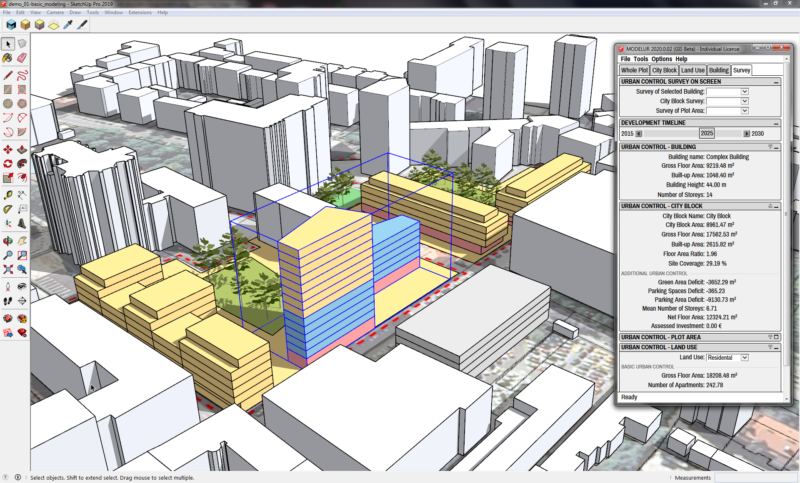

Meet Modelur
============

Welcome to Modelur User Guide!

[Modelur](https://modelur.eu) is a parametric urban design tool that helps architects, urban designers and planners quickly create urban design projects and make well-informed decisions during the early stages of urban design. Modelur achieves this by employing parametric modeling approach and real-time calculation of key urban control parameters, such as Floor Area Ratio, Built-up Area or Required number of Parking Lots on-the-fly.

Modelur is implemented as a plug-in for [Trimble SketchUp](http://www.sketchup.com).

