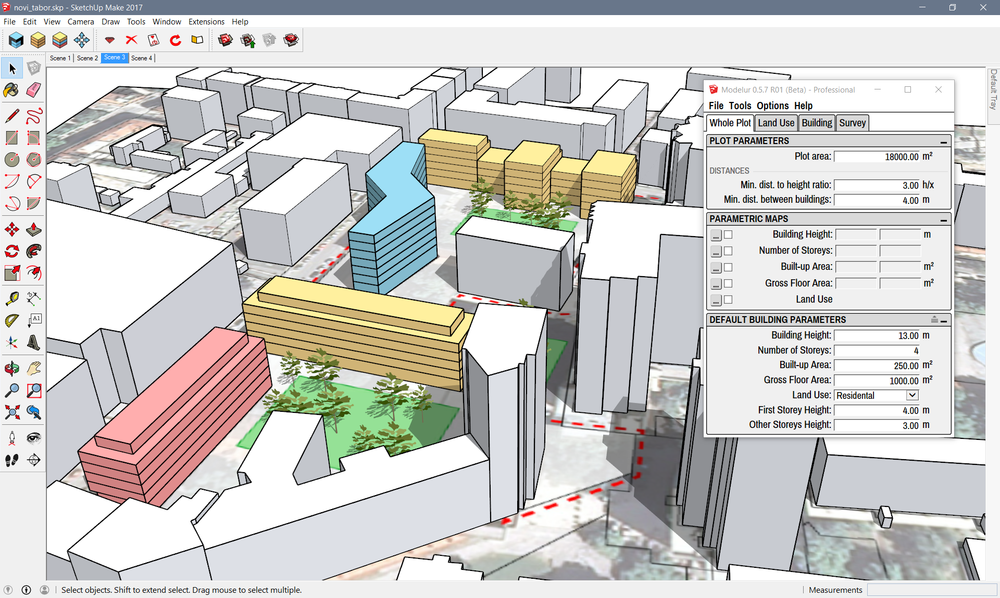

Welcome to Modelur User Guide!
===================

[Modelur](https://modelur.eu) is a parametric urban design tool that helps architects, urban designers and planners quickly create urban design projects and make well-informed decisions during the early stages of urban design. Modelur achieves this by employing parametric modeling approach and real-time calculation of key urban control parameters, such as Floor Area Ratio, Built-up Area or Required number of Parking Lots on-the-fly.

Modelur is implemented as a plug-in for [Trimble SketchUp](http://www.sketchup.com).

Although we strive to make Modelur as intuitive as possible, we can not escape the need for good user documentation. Please note that this documentation is part of Modelur Beta release. As such, it is still work in progress and it will be updated quite a lot during the following months. If you find some mistake or you miss some explanation, please drop us an [e-mail](mailto:support@modelur.com).

Using this guide
----------------

This guide can be used in several ways. You can use it as a [quick start guide](quickstart), to get you up-and-running with Modelur fast. If you want to get help and more details about some functionality of Modelur, [Detailed Workflow](detailed-workflow) section is for you. It explains every detail of how Modelur works and how urban control values are calculated. In between, there are Menu and Tabs sections, which provide more detail on Modelur user interface.