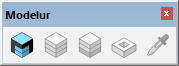
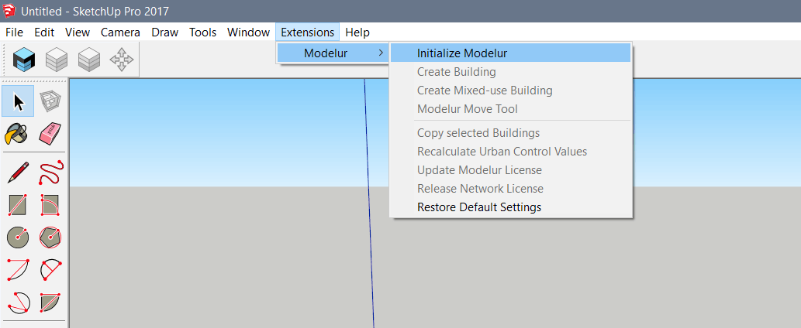
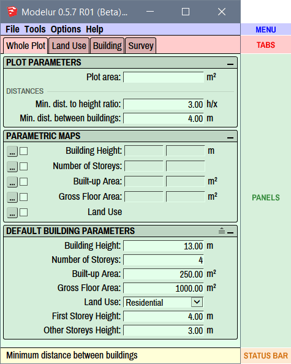
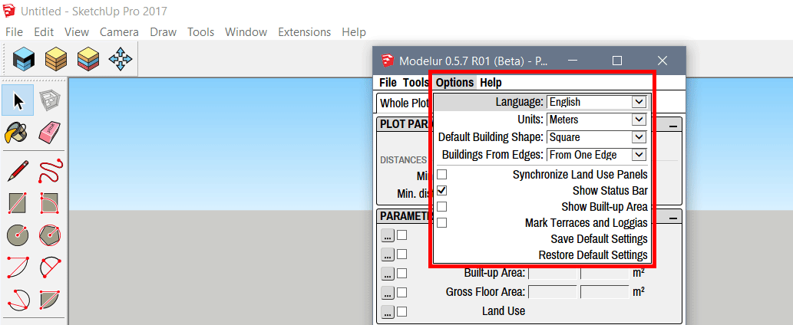
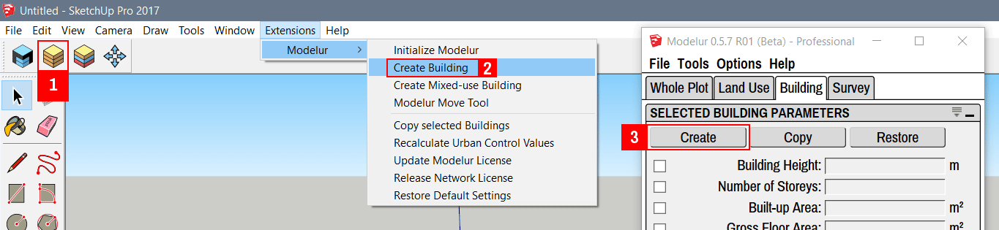
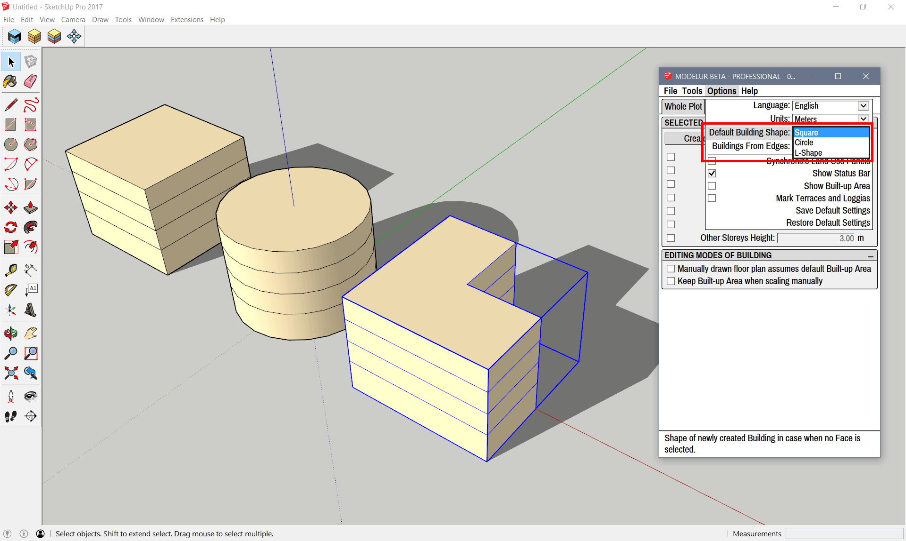
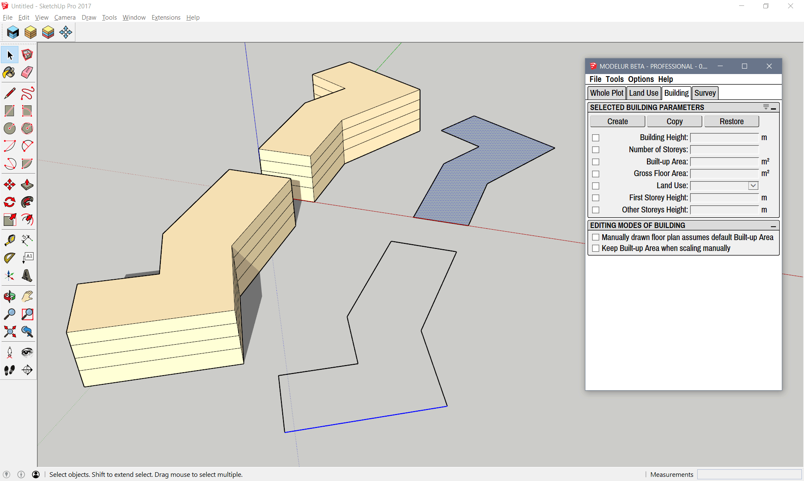
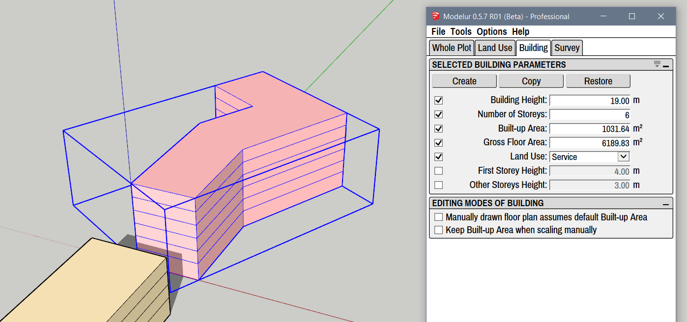

In this section we will quickly introduce you to the structure of Modelur's User Interface. Getting to know its logic will help you easily integrate it into your regular workflow.

Initialize Modelur
-----------------------

Once Modelur is installed you have two options to initialize it. First option is to click on the blue icon in Modelur Toolbar. This toolbar shows up once Modelur you install Modelur (Figure 1). 

<figcaption>Figure 1 - Modelur Toolbar. If toolbar is not visible, you can open it via SketchUp menu <i>View > Toolbars > Modelur</i>. To initialize it, click on the blue Modelur icon. This toolbar can be stacked next to other toolbars in SketchUp.</figcaption>

Second option to initialize Modelur is to navigate to it through SketchUp menu _Plugins > Modelur > Initialize Modelur_ (Figure 2).

<figcaption>Figure 2 - Alternative way to initialize Modelur through SketchUp menu <code>Plugins > Modelur > Initialize Modelur</code>. Please note that Plugins menu was called Extensions in previous versions of SketchUp.</figcaption>

Once Modelur is initialized, its user interface is opened. Modelur's main User Interface (UI, Figure 3) is composed of four parts: Menu, Tabs, Panels and Statusbar.

User Interface Overview
-----------------------

#### Menu
Menu is located at the top of the User Interface. It is the place where you go to when you want to save data (e.g. export Urban Control Indicators), change preferences (e.g. Language) or get some help (e.g. open this User Guide). Detailed description is available in the Menu section.

#### Tabs
Tabs are located below the Menu. They represent a groups of similar tasks. Currently there are four of them: Whole Plot tab (a place to set default values for the whole plot), Land Use tab (a place to create and edit Land Uses and their parameters), Building tab (a place to modify selected Buildings) and Survey (a place where you can monitor Urban Control Indicators). Detailed description is available in the Tabs section.

<figcaption>Figure 3 -  Structure of Modelur User Interface.</figcaption>

#### Panels
Panels are the windows inside each tab. They represent a group of related parameters (e.g. Plot Parameters or Land Use Requirements). Detailed description is available in each of the corresponding Tabs section.

#### Status Bar
Statusbar is located at the bottom of the UI. It's task is to explain you the meaning of abbreviated text when you hover over it. You can turn Status bar on or of in Menu > Options > Show status bar.

Quick Start Guide
-----------------

#### Before you start

Make sure you have [installed Modelur](getting-started/#installation) and quickly check out the [structure of Modelur User Interface](#user-interface-overview), so you get acquainted with basic terminology and UI logic. It should not take you more than two and a half minutes. :-)

#### Step 1 - Initialize Modelur model and configure it

Let's start from the very beginning. With SketchUp open you can initialize Modelur by clicking on a blue Modelur icon in toolbar or via SketchUp menu _Extensions > Modelur > Initialize Modelur_ (as shown in [UI Overview](#ui-overview) section). Once initialized, go to Options menu to set Modelur UI Language and dimension units (meters or feet) according to your needs (Figure 4).
 
 
 
<figcaption>Figure 4 -  Inside Options menu you can set preferred language, dimension units, default shape when Buildings are created, etc. You can find detailed information about all Options inside <a href="../user-interface" >User Interface</a> section.</figcaption>

#### Step 2 - Create Modelur Building

Once Modelur is initialized and set up, you can already create Modelur Building by either clicking on a yellow Modelur Building icon in the Toolbar (1), by clicking on the _Create Building_ (2) entry in SketchUp menu _Extensions > Modelur_ or by clicking on the Create button (3) inside Building tab of Modelur’s user interface (Figure 5).

<figcaption>Figure 5 - Buttons through which you can create Modelur Buildings.</figcaption>

Regardless of which way you choose to create Modelur Buildings, there are always two options - you can create a Building based on a predefined floor plan or based on what you draw. We will take a look at these two in the following paragraphs.

##### Creating Building based on predefined shape

If nothing is selected in your .skp model, Modelur will create a Building with predefined floor plan. This can be selected under Modelur’s _Options > Default building shape_ as shown below. At the moment (Modelur v0.5.7), you can chose among three basic floor plans - Square, Circle and L-Shape (Figure 6).

When new Building is initialized this way, it is created based on the default Parameters as specified for the Whole Plot or Parametric Maps (if defined). We will take a look at those later.

<figcaption>Figure 6 - Different shapes of Buildings when you create a Building and no Face or Edge is selected.</figcaption>

##### Creating Building based on specific floor plan shape

More commonly, you will want to create your own floor plan and create Building based on its shape. To do this, simply draw a horizontal face (Modelur will select it automatically if it is being created) using standard SketchUp’s procedure, or select existing face, and click on Create Building button (Figure 7). This will create a new Modelur Building based on selected face and default parameters.

Alternatively you can also create Building based on selected closed edge loop. To do so, select at least one edge of the loop and click on Create Building button.

<figcaption>Figure 7 - You can create Modelur Building based on any floor plan shape. Just make sure Face or Edge is selected and click on the Create Building button.</figcaption>

#### Step 3 - Changing the Parameters

Parameters work hierarchically in Modelur. What this means is that an object (Building) first looks if its parameter in question (eg. Number of Storeys) is defined. If yes, it uses it. If not, it uses the Parameter from its superior object, which is Parametric Map. If Parametric map does not exist or it is inactive, it takes the value as defined in Whole Plot, which is superior object to Parametric Map. Whole Plot is the topmost object in Modelur.

Object hierarchy for all Building Parameters in current version of Modelur (Beta) is: _Building > Parametric Map > Whole Plot_.

##### Overloaded Parameters

From now on we will call the Parameters that are defined for specific Buildings "overloaded" Parameters. This term applies only to the specific Parameters of specific Buildings. Eg. when we define Parameter for Number of Storeys in Building A, but not in Building B, only the Building A has overloaded parameter for Number of Storeys. We can quickly check which Parameters are overloaded by selecting the Building in question and opening Building tab in Modelur User Interface (Figure 8). There - under Selected Building Parameters panel - all overloaded Parameters are checked and ready to be changed. This is also the place to initialize overloaded Parameters. If we want to change, eg. Land Use of the Building, go ahead - check it and change its value.

<figcaption>Figure 8 - You can quickly check if some of the Building Parameters are overloaded in Selected Building Parameters panel (under Building tab). If checkbox is marked, the Parameter is overloaded; this means that the Building will not change when value of this parameter is changed in its superior object (Whole Plot or Parametric Map). If you do not want the Building to have any parameter overloaded, simply click on a Restore button inside Selected Building Parameters panel.</figcaption>

Please note that overloading / changing one Parameter might also overload other, connected parameters. For example, when you overload Number of Storeys parameter, this will also overload Building Height and Gross Floor Area Parameters, as they are directly connected to Number of Storeys. In other words, when Number of Storeys change, Building’s Height and Gross Floor Area change, too.