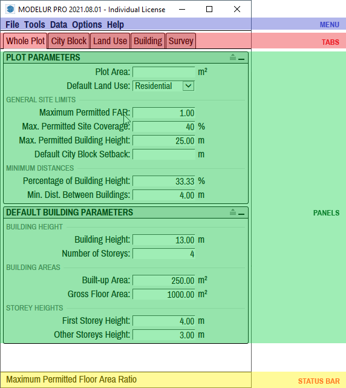

UI overview
===========

In this section we will quickly introduce you to the structure of Modelur's User Interface. Getting to know its logic will help you easily integrate it into your regular workflow.

Once Modelur is installed you have two options to initialize it. First option is to click on the blue icon in Modelur Toolbar. This toolbar shows up once Modelur you install Modelur (Figure 1). 

<figcaption>Figure 1 - Modelur Toolbar. If toolbar is not visible, you can open it via SketchUp menu <i>View > Toolbars > Modelur</i>. To initialize it, click on the blue Modelur icon. This toolbar can be stacked next to other toolbars in SketchUp.</figcaption>

Second option to initialize Modelur is to navigate to it through SketchUp menu _Plugins > Modelur > Initialize Modelur_ (Figure 2).

<figcaption>Figure 2 - Alternative way to initialize Modelur through SketchUp menu <code>Plugins > Modelur > Initialize Modelur</code>. Please note that Plugins menu was called Extensions in previous versions of SketchUp.</figcaption>

Once Modelur is initialized, its user interface is opened. Modelur's main User Interface (UI, Figure 3) is composed of four parts: Menu, Tabs, Panels and Statusbar.

<figcaption>Figure 3 -  Structure of Modelur User Interface.</figcaption>

#### Menu
Menu is located on top of the UI. It is the place where you go to when you want to save data (e.g. export Urban Control Indicators), change preferences (e.g. Language) or get some help (e.g. open this User Guide). Detailed description is available in the Menu section.

#### Tabs
Tabs are located below the Menu. They represent a groups of similar tasks. Currently there are four of them: Whole Plot tab (a place to set default values for the whole plot), Land Use tab (a place to create and edit Land Uses and their parameters), Building tab (a place to modify selected Buildings) and Survey (a place where you can monitor Urban Control Indicators). Detailed description is available in the Tabs section.

#### Panels
Panels are the windows inside each tab. They represent a group of related parameters (e.g. Plot Parameters or Land Use Requirements). Detailed description is available in each of the corresponding Tabs section.

#### Status Bar
Statusbar is located at the bottom of the UI. It's task is to explain you the meaning of abbreviated text when you hover over it. You can turn Status bar on or of in Menu > Options > Show status bar.