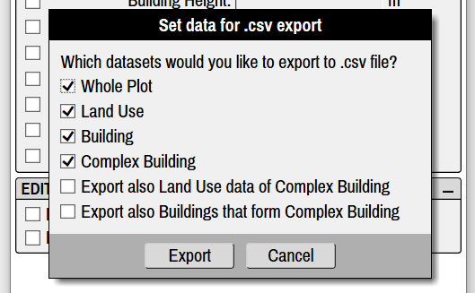

This part contains all the information related to Modelur User Interface window, dialogs and keyboard shortcuts.

Menu
----

Menu is the topmost part of Modelur's user interface window (Figure 4.01). It containts four sub-categories: [File](#file), [Tools](#tools), [Options](#options) and [Help](#help), which are explained in detail below.

<figcaption>Figure 4.01 - Location of Modelur Menu.</figcaption>

#### File

##### File > Open
Opens a dialog window that allows you to open existing SKP file.

##### File > Export Urban Design Control Values…
This is used to export urban control values (such as Gross Floor Area, FAR, Required number of parking lots, etc.) of currently opened model into CSV file. Before exporting the data, you have an option to choose which values you want to export (Whole Plot, Land Uses, Buildings, Complex Buildings). By default all options are selected for export (Figure 4.02).

Additionally, when you choose to export data for Complex Buildings, you have an option to export more details about it. This can be done be either exporting its data 1) by Land Use and 2) for each Simple Building that constitutes it, or both.

<figcaption>Figure 4.02 - You can select which data you want to export to CSV file.</figcaption>

Exported CSV file can then be opened by any major spreadsheet software (eg. Excel, Google Sheets or LibreOffice Calc, Figure 4.03).

_Tip: When importing the data, make sure you have semicolon marked as separator sign in the spreadsheet software you are using._

<figcaption>Figure 4.03 - Example of urban control values exported to raw CSV file (left window) and imported to the spreadsheet software (right window).</figcaption> 

#### Tools
#### Options
#### Help

Whole Plot
----------

#### Plot Parameters
#### Parametric Maps
#### Default Building Parameters

Land Use
--------

Under Land Use tab you can add, edit or remove Land Uses used by Modelur. This is the place to fine-tune all the parameters related to Land Uses which are used to calculate urban control values based on your current design in real-time, eg. Net Floor Area, Number of Apartments, Required Number of Parking Lots, etc.

#### Land Use Requirements

**Add _button_** creates new Land Use. When creating new Land Use, Modelur will copy parameters of currently selected Land Use into newly created one. Once new Land Use is created, you can change the parameters as with any other Land Use.

**Remove _button_** removes currently selected Land Use from Modelur model. If some of the Buildings have assigned Land Use that is being deleted, it will be replaced by default Land Use as specified in the _Whole Plot > Default Building Parameters_.

**Edit _button_** opens a panel to rename selected Land Use.

**Land Use _dropdown_** lists all Land Uses in current model. In order to change Land Use parameters you need to select it here. Once Land Use of your choice is selected, you can start editing all of its parameters.
  
**Color _input field_** specifies the color that is used to mark all Buildings that use selected Land Use. You can specify it directly as a hex value or your can click on the small color button on the left side of this line. Clicking on the button will open up a color picker s you can easily change the color of selected Land Use. Please note that each Land Use is also connected to respective SketchUp Material and that changing either is synced automatically. So, if you change a color of certain Material in SketchUp, the change will be reflected in Land Use color, too, and vice versa.

**Add this Land Use values to the sum total _checkbox_** tells Modelur if the urban control values (eg. Gross Floor Area, Required Number of Parking Lots, etc.) of selected Land Use should be added to the sum of Whole Plot or not. If checkbox is ticked, selected Land Use urban control values will be added to the sum of Whole Plot. If checkbox is not ticked, urban control values will not be added to the sum of Whole Plot.

**Add only Parking values to the sum total _checkbox_** tells Modelur to add _only_ Parking Spaces related values to the sum of Whole Plot. This is particularly useful if you create for example an underground Garage that is not supposed to be added to the Floor Area Ratio, Gross Floor Area, etc, but you want to take into account its Parking Spaces to calculate potential Parking deficit of the Whole Plot.

Building
--------

#### Selected Building Parameters
#### Editing Modes of Building

Survey
------

#### Urban Control Survey on Screen
#### Warnings
#### Urban Control - Selected Building
#### Urban Control - Plot Area
#### Urban Control - Land Use
#### Development Timeline

**Development Timeline** slider is used to show/hide Modelur Buildings based on their construction / demolition year. The range is automatically set to -1/+1 from the min and max construction / demolition year as [specified in Buildings](#selected-building-parameters). If no construction / demolition year is specified in any Building, span will be set to default as specified in [defaults.json](/getting-started/#preferences-location).

_Example: Say you have modeled 10 Buildings. You specified that the oldest Building in the model was built in 2010 and the newest will be built in 2025. Development Timeline will thus stretch from 2009 (min -1) to 2026 (max +1). If you then set one Building's demolition date to be in 2032, Development Timeline will update its span immediately from 2009 to 2033._

Using the slider you can easily move back and forth in time. Modelur will show only existing buildings at selected time (year) and recalculate all urban control values so they reflect choosen year's state only. 