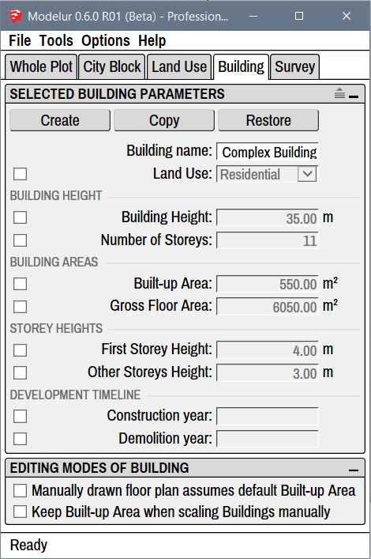

Under Building tab (Figure 4.71) you can create and modify Buildings. Additionally, you can also define different zoning rules and
default Building Parameters for each Building.

<figcaption>Figure 4.71 - Building tab, which shows Parameters of selected Building.</figcaption>

!!! hint "Compact and Extended View"
    In case you don't see separators between parameters you can turn them on using the extend icon on the top right corner of each panel: .

Selected Building Parameters
----------------------------

Inside the Selected Building Panel you can modify the Parameters of selected Building(s).

#### Buttons ####

**Create**

Create button is used to create simple Building, the same way as by clicking on the yellow _Create Building_ icon in Modelur Toolbar. If no Face or Edge Loop is selected, Modelur will create a new Building based on default Building parameters. However, if Face(s) or Edge Loop(s) are selected, it will create new Building based on selected shape. This way you can create Building of arbitrary floor plan.

**Copy**

When some Buildings are selected, you can use Copy button to create their copies. Alternatively you can also use SketchUp's built-in copy methods (eg. by moving the Building around and pressing on the ++ctrl++ key).

**Restore**

Restore button is used to reset all Building parameters to its default values.

#### Name and Land Use ####

**Building Name**

Using Building Name parameter you can change Building's name, which is used to easily track different Buildings. Alternatively you can also rename the Building in the SketchUp's Outliner or in the Entity Info panel the same way as you would rename any other SketchUp Group when selected.

**Land Use**

Using Land Use _dropdown menu_ you can set the Land Use selected Building(s). Land Uses are used to calculate Building's units (eg. apartments, residents, offices, etc), parking requirements, green area requirements, etc. To learn more about these settings, please visit [Land Use section](land_use) of this page.

#### Building Height ####

**Building Height**

Building height sets how tall should the Building be in chosen units (metric or imperial). When changing Number of Storeys, First Storey Height and Other Storey Heights this parameter will adapt itself automatically.

**Number of Storeys**

Number of storeys sets the number of Building's storeys. When you change this parameter, Building Height (described above) will be adapted automatically to reflect calculated height based on Number of Storeys and First and Other storeys Height (described below).

#### Building Areas ####

**Built-up Area**

Built-up area sets the floor area size of the Building. Please note that this value will be automatically overloaded when creating the Building (to keep drawn floor area size) unless you check the _Manually drawn floor plan assumes default Built-up Area_ under _Building tab → Editing Modes of Building_. Built-up Area will automatically be adapted if you change Gross Floor Area (described below) to match the division of Gross Floor Area with Number of Storeys.

**Gross Floor Area**

Gross floor area parameter is used to define gross floor area size of the Building. If Building is created from scratch (no horizontal SketchUp Face is selected), this will be used to determine size of the Building (in combination with Number of Storeys).

#### Storey Heights ####

**First Storey Height**

First storey height is used to set the height of Building's ground floor. Changing this parameter will change default Building Height, too.

**Other Storeys Height**

Other storeys height is used to set the height of all Building's storeys above ground floor. Changing this parameter will change default Building Height, too.

#### Development Timeline ####

**Construction Year**

By specifying construction year you can define when the selected Building is expected to be built. Once construction year is set, you can use [Development Timeline](survey/#development-timeline) option in _Survey tab_ to change timeline year and see how the development will evolve in time.

**Demolition Year**

By specifying demolition year you can define when the selected Building is expected to be demolished. Once demolition year is set, you can use [Development Timeline](survey/#development-timeline) option in _Survey tab_ to change timeline year and see how the development will evolve in time.

Editing Modes of Building
-------------------------

In this section you can determine behavior of the Building when you create or modify it.

**Manually drawn floor plan assumes default Built-up Area**

Check this option if you want the newly created Buildings to match the size of [Built-up Area](#building-areas) when they are created. If this option is unchecked, new Buildings will have the Built-up Area overloaded so they keep drawn floor area size. By default this option is turned off.

**Keep Built-up Area when scaling Buildings manually**

Check this option if you want to scale Buildings horizontally, but also want to make sure they do not change their Built-up Area. In other words, if you have this option checked and you scale the building in X direction, Modelur will calculate and apply the Y dimension so that the Built-up Area will not change. By default this option is turned off.
