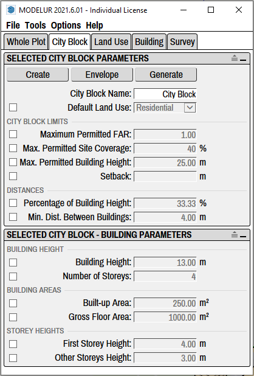
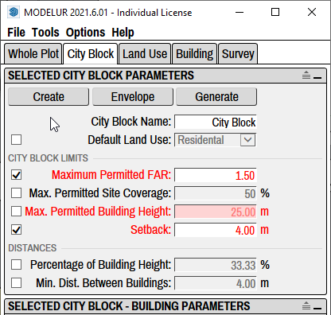

Under City Block tab (Figure 4.41) you can add, edit or remove [City Blocks](https://en.wikipedia.org/wiki/City_block), using which you can separate the whole development into smaller parts for which Urban Control Values (eg. FAR, Required Parking Spaces, etc.) are calculated separately. Additionally, you can also define different zoning rules and default Building Parameters for each City Block.

<figcaption>Figure 4.41 - City Block tab, which shows Parameters of selected City Block. In this case only Land Use is overloaded (set specifically for selected City Block), while other (non-checked) are taken from the Whole Plot.</figcaption>

!!! hint "Compact and Extended View"
    In case you don't see separators between parameters you can turn them on using the extend icon on the top right corner of each panel: .

Selected City Block Parameters
----------------------------
Inside this panel you can define different parameters and requirements that need to be met in selected City Block(s). If they are left unchanged, City Block will take them from the [Whole Plot](whole_plot/#plot-parameters). This panel will show information for the last City Block selected in 3D Window. If there are no City Blocks selected, it will show the information for the City Block of last Building selected (assuming it is placed on a City Block).

#### Buttons ####

**Create**

Create _button_ is used to create City Block, the same way as by clicking on the yellow _Create City Block_ icon in Modelur Toolbar. If no Face or Edge Loop is selected, Modelur will switch to Line Tool and wait until you draw a new Face. Once you draw a Face (closed planar Edge loop), Modelur will convert it to City Block. If you switch to some other SketchUp Tool, Modelur will not create new City Block.

However, if Face(s) or Edge Loop(s) are selected, it will create a new City Block(s) based on selected shape(s). When a City Block is first created, it will contain the default Parameters as specified in the Whole Plot [Plot Parameters](whole_plot/#plot-parameters) and [Default Building Parameters](whole_plot/#default-building-parameters), respectively.

When created, City Blocks are locked by default. You can change this setting in Modelur menu Options → Lock City Blocks Upon Creation.

**Sync**

Sync _button_ is used to open the [Sync City Block Parameters](tools/#sync-city-block-parameters) tool. With it you can easily transfer Parameter values from one City Block to another.

**Select All**

Select All _button_ is used to select all City Blocks in your project at the same time. Any changes to City Block parameters will then apply to all City Blocks.

#### Name and Land Use ####

**City Block Name**

Using City Block Name parameter you can change City Block's name, which is used to easily track different City Blocks. Alternatively you can also rename the City Block in the SketchUp's Outliner or in the Entity Info panel   the same way as you would rename any other SketchUp Group when selected.

**Default Land Use**

Using Default Land Use _dropdown menu_ you can set the Land Use that will be applied by default to each Building(s) in the City Block. Land Uses are used to calculate Building's units (eg. apartments, residents, offices, etc), parking requirements, green area requirements, etc. To learn more about these settings, please visit [Land Use section](land_use) of this page.

#### City Block Limits ####

Under City Block Limits you can set the default constraints set by zoning ordinance for specific City Block so that Modelur can warn you if they are exceeded. But it will not prevent you from exceeding them.

In case your development model exceeds set constraints, they will become red, to warn you about it (Figure 4.42). Once the model is fixed to meet constraints again (or when zoning ordinance constraints for selected City Blocks themselves are updated), exceeded parameters will turn back to black.

<figcaption>Figure 4.42 - When text color in Modelur user interface turns red, the Parameters in question are exceeded.</figcaption>

**Maximum Permitted FAR**

Using maximum permitted Floor Area Ratio you can define allowable FAR for the selected City Block. In case FAR value of the City Block is exceeded, this line will become red, to warn you about it. If you don't want Modelur to validate achieved FAR for the selected City Block, simply erase this value and hit ++enter++.

**Max. Permitted Site Coverage**

Using maximum permitted Site Coverage you can define allowable Site Coverage for the selected City Block. In case Site Coverage value for the selected City Block is exceeded, this line will become red, to warn you about it. If you don't want Modelur to validate achieved Site Coverage for the selected City Block, simply erase this value and hit ++enter++.

**Max. Permitted Building Height**

Using maximum permitted Building Height you can define height restrictions for the selected City Block. In case some Building placed on the selected City block is higher than specified inhere, this line will become red, to warn you about it. If you don't want Modelur to validate Buildings Heights for the selected City Block, simply erase this and hit ++enter++.

#### Distances ####

**Min. Distance to Height Ratio**

Minimum distance to height ratio is used to calculate minimum distance between two Buildings based on their heights within the selected City Block. To calculate distance, the Building's height is divided by the parameter value. Example: if parameter is set to 2, the minimum distance will be 1/2 of Building's height, if set to 3, it will be 1/3 of Building's height. If the Buildings are placed closer than the calculated distance, they will be marked red (assuming that [Too low distance between Buildings](survey/#warnings) is active).

**Min. Dist. Between Buildings**

Minimum distance between Buildings is the absolute distance (in meters or feet) between any two Buildings within the selected City Block. If the Buildings are placed closer than this specified distance, they will be marked red (assuming that [Too low distance between Buildings](survey/#warnings) is active).

Note that distances will be verified also between the Buildings that are not within the same City Blocks, but each according to it's parent City Block settings.

Selected City Block - Building Parameters
-----------------------------------------

Default Building Parameters inside the City Block tab are used to overload default parameters as set by the Whole Plot according to [Modelur's hierarchy](/quickstart/#step-3-changing-the-parameters). This means that if the parameter in question is not [defined by the Building itself](building/#selected-building-parameters), Modelur will apply the values defined here to the Building. For example, when you create a new Building, it will contain Number of Storeys, Land Use, etc. as specified here or in the Whole Plot.

!!! tip "Interactive Zoning"
    If you move a Building from one City Block to another, it will update all of its default Parameters to match those in new City Block. This way the Building adjusts itself automatically to the zoning rules of specific City Blocks.

#### Building Height ####

**Building Height**

Building height sets how tall should the Building be by default inside selected City Block. When changing Number of Storeys, First Storey Height and Other Storey Heights this parameter will adapt itself automatically.

**Number of Storeys**

Number of storeys sets the default number of Building's storeys inside selected City Block. When you change this parameter, Building Height (described above) will be adapted automatically to reflect calculated height based on Number of Storeys and First and Other storeys Height (described below).

#### Building Areas ####

**Built-up Area**

Built-up area sets the default floor area size of the Building inside selected City Block. Please note that this value will be automatically overloaded when creating the Building (to keep drawn floor area size) unless you check the Manually drawn floor plan assumes default Built-up Area under Building tab → [Editing Modes of Building](building/#editing-modes-of-building). Built-up Area will automatically be adapted if you change Gross Floor Area (described below) to match the division of Gross Floor Area with Number of Storeys.

**Gross Floor Area**

Gross floor area parameter is used to define default gross floor area size of the Building inside the selected City Block. If Building is created from scratch (no horizontal SketchUp Face is selected), this will be used to determine size of the Building (in combination with Number of Storeys).

#### Storey Heights ####

**First Storey Height**

First storey height is used to set the default height of Building's ground floor inside the selected City Block. Changing this parameter will change default Building Height, too.

**Other Storeys Height**

Other storeys height is used to set the default height of all Building's storeys above ground floor inside the selected City Block. Changing this parameter will change default Building Height, too.
