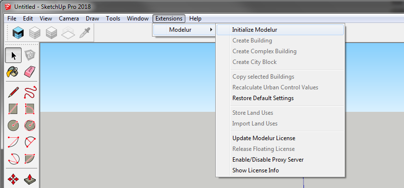

Extensions Menu is the part of SketchUp from which you can initialize Modelur and trigger some of its functionality (Figure 4.7.01).

<figcaption>Figure 4.7.01 - Location of Modelur in SketchUp menu Extensions (Plugins in older versions).</figcaption>

#### Initialize Modelur ####
Click on this button when you want to start Modelur and open user interface. In order to start Modelur you must be connected to the internet.

#### Create Building ####
This button will create simple Building (one Land Use type). If a face or a loop is selected, a building will be created based on its shape. If no face or loop is selected, Modelur will create a new Building based on [default Building parameters](whole_plot#default-building-parameters).

#### Create Complex Building ####
This button will create Complex (Mixed-use) Building.

Complex Building is a group of Buildings (with different Land Use) combined into one Building. You can edit Complex Building as a whole or each part separately. If you want to edit Complex Building as a whole, select the whole Complex Building by clicking on it. It's parameters will be displayed in the [Building tab](building) where you can edit them.

If you want to edit only specific parts of a Complex Building, enter the Complex Building as you would any SketchUp Group by double clicking on it first, then select part of the Complex Building by clicking on it once. Parameters of that part will be displayed in the [Building tab](building) 

#### Create City Block ####

Create _button_ is used to create City Block, the same way as by clicking on the yellow _Create City Block_ icon in Modelur Toolbar. If no Face or Edge Loop is selected, Modelur will switch to Line Tool and wait until you draw a new Face. Once you draw a Face (closed planar Edge loop), Modelur will convert it to City Block. If you switch to some other SketchUp Tool, Modelur will not create new City Block.

However, if Face(s) or Edge Loop(s) are selected, it will create a new City Block(s) based on selected shape(s). When a City Block is first created, it will contain the default Parameters as specified in the Whole Plot [Plot Parameters](whole_plot/#plot-parameters) and [Default Building Parameters](whole_plot/#default-building-parameters), respectively.

When created, City Blocks are locked by default. You can change this setting in Modelur menu Options → Lock City Blocks Upon Creation.

#### Copy Selected Buildings ####

By clicking on this button, Modelur will create copies of all selected Modelur Buildings.

#### Recalculate Urban Control Values ####

In case you want to double check if Urban Control Values are calculated correctly, you might want to use this button to refresh them from scratch.

#### Restore Default Settings ####

This will reset your current Modelur settings to default state (the same as when you first install Modelur).

#### Send Modelur Data to Excel (Windows only) ####

Once you click on this button, Modelur will open up Excel (it should already be
installed on your Windows OS) and populate it with the data from Urban Control
Data Table. New XLSX file will have the same name as your SKP file and will be
saved next to it.

Once connection to Excel is established, Modelur will send updated data whenever
you make a change to your model. By default, Modelur will create and XLSX file
with one tab, named _Modelur Live Data_. In order for Modelur to recognize this
tab in the future (once saved and reopened), make sure not to rename this tab.

After XLSX file is populated with values from Modelur, you can add your own sheet
and refer to it (and its cells) to add your own calculations and graphs.

!!! tip "Setting the data that is sent to Excel"
The data that is sent to Excel is the same as the data that you see in [Urban
Control Data Table](menu/#tools). In case you want to change which data is being
sent to Excel, you can do so there by (un)checking appropriate checkboxes.

When you add new Modelur objects (Land Uses, Buildings or City Blocks), Excel rows usually
change. To overcome problem of referencing wrong data in your formulas when rows change,
Modelur adds named cells to exported data labels so you can reference specific values based
on their names.

<figcaption>Figure 4.7.02 - Example use of Excel named cells.</figcaption>

#### Store Land Uses ####

Use this command to store all Land Uses of current model into external file (`stored_land_uses.json` file located in [Appdata folder](/getting-started/#modelur-location)). This can be useful when you want to transfer Land Uses from one model to another or when copying Buildings and City Blocks with non-default Land Uses from one model to another.

When copying Buildings or City Blocks with non-default Land Use from one SKP model to another, Modelur will take a look at information stored in the above JSON file. If it finds it, it will add new Land Use to existing Model automatically. If not, it will replace it with the default Land Use (and show you a notice about that).  

#### Import Land Uses ####

Use this command to import all Land Uses stored in an external file. Note that this button will be unavailable if you haven't yet stored Land Uses.

Once triggered, a menu will open asking you if you want to update existing Land Uses values. If you choose Yes, Modelur will update all Land Uses with new values. If you choose No, it will skip existing Land Uses and add only new ones (those that are non-existent in the model, but specified in the external file).

#### Select Buildings by Land Use ####

Use this button to _select_ or _filter_ Buildings by their Land Use. Once you click on this button a new window with all model's Land Uses will open. Select the Land Use of your choice and click OK. This function will operate differently based on your selection:

1. If no Buildings or if only Buildings that don't have chosen Land Use selected, Modelur will select _all_ Buildings with selected Land Use.
1. If there are some Buildings in your selection that have chosen Land Use (but also some that don't), Modelur will filter selection to only those Buildings  that have selected Land Use.

!!! note "Selecting Buildings by Land Use in Complex Buildings"
    In case of Complex Buildings, that might have some parts of Selected Land Use (but also some with other Land Uses), Modelur will pick complete Complex Building.
    
#### Select City Blocks by Land Use ####

Use this button to _select_ or _filter_ City Blocks by their Land Use. Once you click on this button a new window with all model's Land Uses will open. Select the Land Use of your choice and click OK. This function will operate differently based on your selection:

1. If no City Blocks or if only City Blocks that don't have chosen Land Use selected, Modelur will select _all_ City Blocks with selected Land Use.
1. If there are some City Blocks in your selection that have chosen Land Use (but also some that don't), Modelur will filter selection to only those City Blocks that have selected Land Use.

#### Update Modelur License ####

Click this button to enter your (new) Modelur license key.

#### Release Floating License ####

This button is enabled only when using floating license of Modelur. By clicking on it, you will release your seat for someone else to take and Modelur will close until you request your seat again.

#### Enable/Disable Proxy Server ####

In case you are trying to use Modelur behind a proxy server, it might sometimes fail to validate its license online. In order to prevent such errors, you need to engage validation through proxy server. To do so, click on this button and select Yes. Once enabled, you need to restart SketchUp.

!!! tip "Check your firewall"
    Before setting up proxy server, also please make sure to allow Modelur to connect to *.modelur.com in your firewall.
    
#### Show License Info ####

This will show you basic details about your license: _License Key_, _License Expiration Date_ and _License Type_ you are using.
