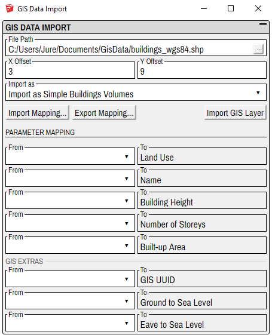

# GIS import

WARNING/TODO: Doesn't work on SketchUp 2016.

GIS import is a brand new Modelur feature, which allows user to import __Shapefiles (shp)__ and __GeoJSON__ files to SketchUp and transform 2D GIS data to 3D image.

GIS import allows you to __map GIS attributes to Modelur parameters__.
For example you can map GIS attribute `NUM_OF_STO` to Modelur parameter `Number of storeys` and Modelur will generate building and use value of chosen GIS attribute as its height.

## Requirements
### Set Geo-location
Before you can import GIS data or even open GIS dialog in Modelur, you need to have geolocated model. You can set the model's geolocation under `File -> Geo-location` in SketchUp.

### Supported file types
Modelur supports __Shapefiles (shp)__ and __GeoJSON__ file types. Files need to be saved in __WGS84 coordinate system__.

### Supported data types
Modelur supports the following data types:
- __polygons__ (can be imported as _Modelur Buildings_, _Complex Buildings_ or _Building Volumes_)
- __points__ (can be imported as _Trees_, _Waste Bins_ or _Terrain_)
- __polylines__ (can be imported as _Metro_ or _Underground Pipes_)

## Usage
### Open your model in Sketchup
Open your file in SketchUp. If _geolocation_ is not set, set it under `File -> Geo-location` in SketchUp.

<figcaption>Figure 1.1 - Opened model in SketchUp.</figcaption>

### Open GIS Data Import window
Initialize Modelur and go to `File -> Import GIS Data ... ` to open __GIS Data Import__ window.

<figcaption>Figure 1.2 - Open GIS Data Import window.</figcaption>
 
Gis Data import window will open:

<figcaption>Figure 1.3 - GIS Data Import window.</figcaption>

Here you will import your `.shp` or `.geojson` file and set preferences (see _GIS Preferences_ section).

### Import GeoJson or Shapefile
Click the `...` button at the right side of the _File Path_ field and select `.shp` or `.geojson` file that you want to import.

<figcaption>Figure 1.4 - Import .shp or .geojson file.</figcaption>

### Offset
Determine the offset for your model if needed. The unit for offset is the same as the currently chosen unit in Modelur (meters or feet).

<figcaption>Figure 1.5 - Set offset.</figcaption>

### Import as
If you import .shp/.geojson file that contains __polygons__, you can import them as _Modelur Buildings_, _Complex Buildings_ or _Building Volumes_. If your .shp/.geojson file contains __points__, they can be imported as _Trees_, _Waste Bins_ or _Terrain_. File containing __polylines__ can be imported as _Metro_ or _Underground Pipes_.

### Import Mapping...
By clicking this button you will import parameter mapping from a mapping (`.mjson`) file. Parameter mapping will be shown in the _Parameter Mapping_ section.

### Export Mapping...
By clicking this button you will export current parameter mapping (from _Parameter Mapping_ section) to a mapping (`.mjson`) file.

### Import GIS layer
When you finish the mapping you can import GIS layer.
This will generate Modelur objects and add them to a new SketchUp layer to your model.

### Mapping
For every Modelur parameter field in mapper you can open dropdown and choose GIS attribute. Every dropdown field consists of name of GIS attribute and in bracket there is value of attribute for some object, which can help you select the right attribute.

<figcaption>Figure 1.6 - Mapping.</figcaption>

If you don’t map anything, Modelur will assign default attributes to buildings (Default Land Use, Default Number of Storeys etc.)

If you map Land Use field, a new Land Use Mapping will be shown below the Parameter mapping.

#### Parameter
Parameter mapper is basic and is generated in Modelur.
Is shown based on chosen import type. It connects GIS attributes with Modelur parameters, based on which Modelur objects are created. Based on some of these fields the new mappers are generated, which use mapped attribute values. On left side are dropdowns with names of all GIS attributes, on the right side is Modelur parameter name.

#### Land Use
Is generated from unique attribute values of chosen attribute, mapped to Land Use parameter field in parameter mapper. It connects attribute values to Modelur Land uses. On left side is value of attribute, on the right side is dropdown with all Land Uses.

#### Color
Is generated from unique attribute values of chosen attribute, mapped to Pipe or Tube Color parameter field in parameter mapper. It connects attribute values to possible colors. On left side is value of attribute, on the right side is dropdown with possible colors.

#### GIS non-mapped parameters
While some GIS attributes can remain unmapped, some can not. For example, tube diameter for tubes. Without tube diameter, no accurate tube model can be made.

Those parameters will be visible in GIS non-mapped parameters section.
There user can choose values in dropdowns. It doesn’t offer you list of attributes but actual values that are available for certain parameter. In GIS non-mapped parameter values panel are therefore shown only fields that are not mapped in Parameter Mapping.

In GIS non-mapped parameter values panel are therefore shown only fields that are not mapped in Parameter Mapping. Here you can choose value from dropdown. It doesn’t offer you list of attributes but actual values that are available for certain parameter. Those parameters cannot be left unmapped, and if they’re not mapped in Parameter Mapping they will use default option in other mapping.

## GIS Preferences
GIS preferences are general settings that that let you decide how Modelur will perform certain functions. If you don't see them, click on the square icon to expand _GIS Preferences_ window.

### Max number of mapped Land Uses
Land Use mapper is generated from unique values of selected GIS attribute. If “wrong” attribute is selected Modelur might try to generate mapper with 1000 or more fields which takes a long time and can also broke the program. With this preference you can prevent such errors by setting the limit on mapper size.

### Max distance from Origin before warning
When importing GIS file, it might be located away from model’s Geo-location. This might be a mistake or you actually want to import GIS file that is located away from model’s Geo-location. Here you can set max allowed distance before warning. Modelur will not prevent you from importing file that is located far away, but it will warn you if the distance exceeds the allowed location set here.

### Mapping import options
When importing saved mapping file (`.mjson`) you can choose between following options:
#### 1. Clear, use imported mapping only
This will clear all mapping fields that were assigned either manually or by importing other file, and fill it with values from currently selected file.

#### 2. Merge, keep imported mapping for overlapping fields
This option will take into account also already mapped fields, but if fields are defined in mapper and in mapping file, it will use imported file to overwrite it.

#### 3. Merge, keep current mapping for overlapping fields
This option will take into account also already mapped fields, but if fields are defined in mapper and in mapping file, it will use current values and imported mapping file will not be able to overwrite it.

### Update Land Use values (rename to Update same name Land Uses values?)
If Land Uses defined in mapping file differ from the same named Land Uses from model, you can choose what Modelur will do about it.

#### 1. Skip (use existing)
This will use Land Uses defined in model.

#### 2. Overload (update existing)
This will update model Land Uses with specification from mapping file.

### Generate missing Land Uses
If true Modelur will create new Land Uses. If not, it will just use Land Uses from model, and leave mapper fields that require Land Use from mapping file empty.

### Check if mapping file was modified outside Modelur
Mapping file is generated when you press the button `Export Mapping`. This file can then be imported later. It’s recommended to only change the mapping or land use values in Modelur and then export file, not to edit the file manually, because the correct form of file can be corrupted and it can cause some troubles while working with it. Therefore Modelur will notice if file was edited outside Modelur and will warn you if this preference is checked.

### Warn on Offset conflict
Current model and mapping file offsets can differ, which can lead to non-aligned model.
If you select this option, Modelur will warn you when mapping file offset differs from model offset.

### Import mapping automatically if available
When importing GIS file Modelur will check if there is a mapping file with the same name in that folder. If this preference is checked it will be automatically imported. Otherwise you will have to import mapping separately.
