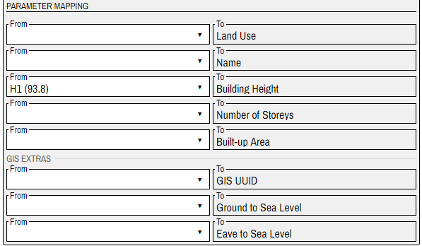
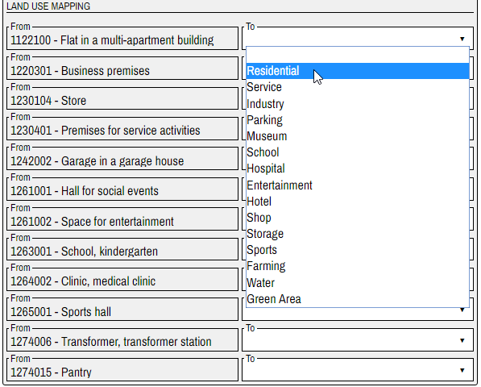
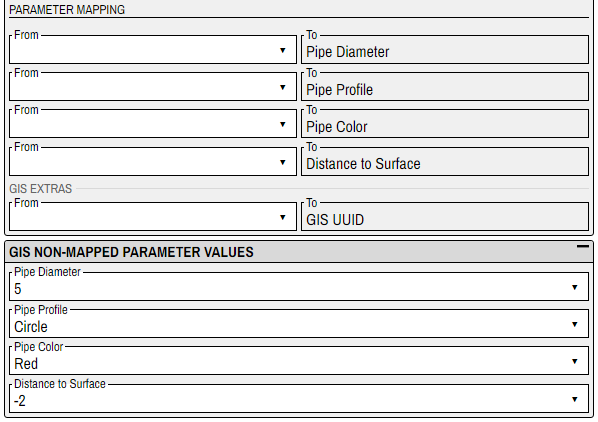
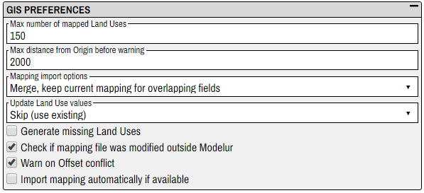

# GIS import

_GIS import_ is a brand new Modelur feature, which allows you to import __Shapefiles__ and __GeoJSON__ files to SketchUp and transform 2D GIS data to a 3D model.

_GIS import_ gives you the possibility to __map GIS attributes to Modelur parameters__.
For example you can map GIS attribute `NUM_OF_STO` to Modelur parameter `Number of storeys`. Modelur will then use the value from GIS attribute when generating Modelur Building objects for GIS layer.

## Requirements
### Set Geo-location
Your SketchUp model needs to have geolocation set before you can import GIS data. You can set the model's geolocation under `File -> Geo-location` in SketchUp.

### Supported file types
You can import GIS data that are saved as __GeoJSON (.geojson)__ or __Shapefiles (.shp)__. Files need to be saved in __WGS84 coordinate system__.

### Supported data types
Modelur supports the following GIS data types:
- __polygons__ (can be imported as _Modelur Buildings_, _Modelur Complex Buildings_, _Modelur City Blocks_ or _Simple Building Volumes_)
- __points__ (can be imported as _Trees_, _Waste Bins_ or _Terrain_)
- __polylines__ (can be imported as _Metro_ or _Underground Pipes_)

## Usage
### Open your model in Sketchup
Open your .skp file in SketchUp. If _geolocation_ is not set, set it under `File -> Geo-location` in SketchUp.

<figcaption>Figure 1.1 - .skp model in SketchUp.</figcaption>

### Open GIS Data Import window
Initialize Modelur and go to `File -> Import GIS Data ... ` to open __GIS Data Import__ window.

<figcaption>Figure 1.2 - Open GIS Data Import window.</figcaption>
 

__Gis Data import__ window will open:

<figcaption>Figure 1.3 - GIS Data Import window.</figcaption>

Here you will import your `.shp` or `.geojson` file and set preferences (see _GIS Preferences_ section).

### Import GeoJson or Shapefile
Click the `...` button at the right side of the _File Path_ field and select `.shp` or `.geojson` file that you want to import.

<figcaption>Figure 1.4 - File Path field.</figcaption>

### Offset
Determine the offset for your model if needed. The unit for offset is the same as the currently chosen unit in Modelur (meters or feet).

<figcaption>Figure 1.5 - Fields for setting offset.</figcaption>

### Import as
Set of choices that will be presented in this dropdown depends on the type of data that you imported from your `.shp` or `.geojson` file.

* If the file contains __polygons__, you can import them as _Modelur Buildings_, _Modelur Complex Buildings_, _Modelur City Blocks_ or _Simple Building Volumes_.
* If the file contains __points__, they can be imported as _Trees_, _Waste Bins_ or _Terrain_.
* If the file contains __polylines__, they can be imported as _Metro_ or _Underground Pipes_.

<figcaption>Figure 1.6 - Import as field.</figcaption>

### Import Mapping...
By clicking this button you will import parameter mapping from a mapping (`.mjson`) file. Parameter mapping will be shown in the _Parameter Mapping_ section.

### Export Mapping...
By clicking this button you will export current parameter mapping (from _Parameter Mapping_ section) to a mapping (`.mjson`) file.

### Import GIS layer
After you set the mapping in the _Parameter Mapping_ section, you use this button. This will generate appropriate Modelur objects and add them to a new SketchUp layer to your model.

<figcaption>Figure 1.7 - SketchUp model with GIS layer.</figcaption>

### Parameter Mapping
Here you connect (map) _Modelur parameters_ with _GIS attributes_. Modelur will use value from mapped GIS attribute for a parameter value. For example, Modelur will use value from GIS attribute `H1` as `Building Height` parameter value when creating Modelur Buildings for GIS layer.

<figcaption>Figure 1.8 - Parameter Mapping area.</figcaption>
 

Options in `From` dropdowns consist of GIS attribute name and a randomly chosen attribute value (e.g. `H1 (93.8)`). We included attribute value to give you an example of what each GIS attribute contains. Hopefully, this will make it easier for you to map attributes to parameters.

Modelur parameters listed on the right (`To` dropdowns) depend on the type of data in your `.shp`/`.geojson` file and on the option you selected in the `Import as` dropdown. For example, if you import polygons as _Modelur Buildings_, you will see the parameters _Land Use_, _Name_, _Building Height_ etc. If you import points as _Trees_, you will see the parameters _Tree Height_, _Tree Species_ etc.

You map Modelur parameter to GIS attribute by selecting the GIS attribute from dropdown on the left (`From` area). Image 1.9 shows us choosing GIS attribute _Soortnaam_ to map to Modelur parameter _Tree Species_.

<figcaption>Figure 1.9 - Example of GIS attribute to Modelur parameter mapping.</figcaption>

 

Some Modelur parameters (e.g `Number of Storeys`) can remain unmapped because Modelur can use default values to create objects for GIS layer. Those parameters that currently do not have default values (and can not remain unmapped) will be listed in the _GIS Non-mapped Parameter Values_ area. See _GIS Non-mapped Parameter Values_ section for more information.

Some parameters, for example  _Land Use_, _Tree Species_ and _Pipe Color_,  offer additional mapping possibilities. See _Additional Parameter Mapping_ section for more information.

#### GIS Extras
This section contains Modelur parameters that are not used for creating Modelur objects (e.g. Modelur Buildings). These parameters just contain some additional information used for placing the objects on the model. For example `Ground to Sea Level` for Buildings.

<figcaption>Figure 1.10 - Parameters in GIS Extras area.</figcaption>

#### Additional Parameter Mapping
Some parameters, for example  _Land Use_, _Tree Species_ and _Pipe Color_,  offer additional mapping possibilities.

When you map such parameter to GIS attribute, additional mapping area will appear under _Parameter Mapping_ area. There you can map for example _Tree Species_ values from GIS to _Tree Species_ values from Modelur.

Let us look at _Land Use_ additional parameter mapping example:

##### Land Use Mapping

_Land Use Mapping_ area appears when you map `Land Use` Modelur parameter.

On the left side (`From`) are listed (unique) values of the GIS attribute that maps to Modelur `Land Use` parameter. On the right side (`To`) are dropdowns containing all Modelur _Land Use_ types.

You map GIS Land Uses to Modelur Land Uses by selecting a Land Use type from the `To` dropdown. Image 1.11 shows us choosing Modelur Land Use _Residential_ to map to GIS Land Use _1122100 - Flat in a multi-apartment building_.

<figcaption>Figure 1.11 - Example of GIS Land Use to Modelur Land Use Mapping.</figcaption>
 

You can map different GIS Land Uses to the same Modelur Land Use.

#### GIS Non-mapped Parameter Values
While some Modelur parameters can remain unmapped (because Modelur can use default values), some can not. For example, all _Metro_ parameters must be mapped.

The parameters that can not remain unmapped and that are not (yet) mapped in the _Parameter Mapping_ area, will be listed in _GIS Non-mapped Parameter Values_ area.

<figcaption>Figure 1.12 - Parameters that are not (yet) mapped in the Parameter Mapping area, will be listed in GIS Non-mapped Parameter Values area.</figcaption>
 

If you map the parameters in the _Parameter Mapping_ area, they will disappear from _GIS Non-mapped Parameter Values_ area.

<figcaption>Figure 1.13 - If you map the parameters in the Parameter Mapping area, they will disappear from GIS Non-mapped Parameter Values area.</figcaption>
 

Dropdowns in the _GIS Non-mapped Parameter Values_ area contain actual values that are available for certain parameter. The chosen value will be used for all objects in GIS layer.

## GIS Preferences
Here you set how Modelur will perform certain GIS related functions.

If you don't see the options, click on the square icon on the right of the  _GIS Preferences_ tittle area. This will expand _GIS Preferences_ area.

<figcaption>Figure 1.14 - GIS Preferences area.</figcaption>

### Max number of mapped Land Uses
_Land Use mapper_ area (see _Land Use Mapping_ section) is generated with unique values of the GIS attribute that maps to _Land Use_ Modelur parameter.

You might accidentally choose a GIS attribute with e.g. 1000 or more fields. Then the generation of _Land Use Mapper_ will take a long time and can even break the program.

You can prevent such errors by setting the limit on _Land Use mapper_ size. Then the _Land Use Mapper_ will contain only the _Max number of mapped Land Uses_ fields.

### Max distance from Origin before warning
Here you can set max allowed distance between model’s geolocation and the geolocation of the GIS file you imported.

Modelur will not prevent you from importing GIS file that exceeds the distance set here, but will show a warning to alert you.

### Mapping import options
When importing saved mapping file (`.mjson`) you can choose between following options:
#### 1. Clear, use imported mapping only
All the mapping fields in the _Parameter Mapping_ area will be cleared and filled with values from the imported mapping file.

#### 2. Merge, keep imported mapping for overlapping fields
Values from the imported mapping file will replace values from the _Parameter Mapping_ area. Those fields in the _Parameter Mapping_ area that are not defined in imported file, will remain unchanged.

#### 3. Merge, keep current mapping for overlapping fields
Values from the _Parameter Mapping_ area will remain unchanged. Only those fields that do not have a value set will be filled with values from imported mapping file.

### Update Land Use values
If _Land Uses_, defined in mapping file you will import, differ from the same named _Land Uses_ from model, you have two options:

#### 1. Skip (use existing)
Use _Land Uses_ defined in model.

#### 2. Overload (update existing)
Update model _Land Uses_ with specification from mapping file.

### Generate missing Land Uses
When you import mapping file, it can happen that the file contains _Land Use_ types that your model does not contain. In that case, `Generate missing Land Uses` option becomes important.

If checked, Modelur will add _Land Uses_ from the mapping file to the model. If not, it will use just _Land Uses_ from the model. Fields that use _Land Uses_ from the mapping file will remain empty.

### Check if mapping file was modified outside Modelur
When you click the `Export Mapping...` button, you generate a mapping file that can be imported to other Modelur instances or used later.

It is highly recommended not to edit the mapping file outside Modelur _GIS Import_ Interface. Otherwise the file form can become corrupted which can cause trouble.

If you choose this option, Modelur will check if the file was edited outside Modelur and warn you if that is true.

### Warn on Offset conflict
If checked, Modelur will warn you when mapping file offset differs from model offset.

### Import mapping automatically if available
If you select this option, Modelur will look for a corresponding mapping file when importing the GIS file (Modelur will look in the folder where GIS file is located for a mapping file with the same name as GIS file).

If the corresponding mapping file is found, it will be automatically imported.
