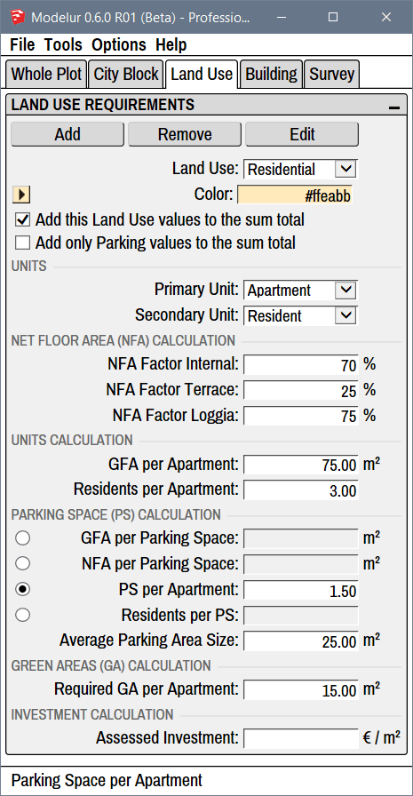

Under Land Use tab (Figure 4.61) you can add, edit or remove Land Uses used by Modelur. This is the place to fine-tune all the parameters related to Land Uses which are used to calculate urban control values based on your current design in real-time, eg. Net Floor Area, Number of Apartments, Required Number of Parking Lots, etc.

<figcaption>Figure 4.61 - Land Use tab, which shows Parameters of Land Use selected in the dropdown menu Land Use.</figcaption>

!!! hint "Compact and Extended View"
    In case you don't see separators between parameters you can turn them on using the extend icon on the top right corner of each panel: .
    
!!! hint "Transferring Land Uses from one SKP model to another"
    Land Use objects are abstract and can not be copied directly between different SKP models directly as they have no 'physical' representation in the model. Nevertheless, you can still transfer Land Uses using the Store and Import Land Use functionality or when copying Buildings and City Blocks from one model to another. For the latter, we advise you to turn on the [Store Land Use changes](/reference/menu/#options) option in Options menu.
    
Land Use Requirements
---------------------

#### Buttons ####

**Add**

Add _button_ creates a new Land Use. When creating new Land Use, Modelur will copy parameters of currently selected Land Use into newly created one. Once new Land Use is created, you can change the parameters as with any other Land Use.

**Remove**

Remove _button_ removes currently selected Land Use from Modelur model. If some of the Buildings have assigned Land Use that is being deleted, it will be replaced by default Land Use as specified in the _Whole Plot → Default Building Parameters_.

**Edit button**

Edit _button_ opens a panel to rename selected Land Use. If you rename Land Use to have the same name as existing one, Modelur will automatically append a 4-digit UID number to it so it can be distinguished by SketchUp Material, too as you can not have two materials with the same name in one SKP model.

#### General Settings ####

**Land Use**

Land Use _dropdown_ lists all Land Uses in current model. In order to change parameters of specific Land Use, you need to select it here. Once Land Use of your choice is selected, you can start editing all of its parameters.

**Color**

Color specifies the color that is used to mark all Buildings and City Blocks that have selected Land Use applied. You can specify it directly as a hex value or your can click on the small color button on the left side of this line. Clicking on the button will open up a color picker so you can easily change the color of selected Land Use.

Each Land Use is also connected to respective SketchUp Material and synced automatically. So, if you change a color of Land Use Material in SketchUp, the change will be reflected in Land Use color, too, and vice versa.

**Add this Land Use values to the sum total**

Add this Land Use values to the sum total _checkbox_ tells Modelur if the urban control values (eg. Gross Floor Area, Required Number of Parking Lots, etc.) of selected Land Use should be added to the sum of Whole Plot or not. If checkbox is ticked, selected Land Use urban control values will be added to the sum of Whole Plot. If checkbox is not ticked, urban control values will not be added to the sum of Whole Plot.

**Add only Parking values to the sum total**

Add only Parking values to the sum total _checkbox_ tells Modelur to add _only_ Parking Spaces related values to the sum of Whole Plot. This is particularly useful if you create for example an underground Garage that is not supposed to be added to the Floor Area Ratio, Gross Floor Area, etc, but you want to take into account its Parking Spaces to calculate potential Parking deficit of the Whole Plot.

Units
-----

**Primary Unit**

Name of Land Use primary unit, which is used in [GFA per Primary Unit](#units-calculation) calculation. Eg. Apartment in Residential Land Use, Office in Service Land Use, etc.

**Secondary Unit**

Name of Land Use secondary unit, which is used in [Secondary Unit per Primary Unit](#units-calculation) calculations. Eg. Residents par Apartment in Residential Land Use, Workplaces per Office in Service Land Use, etc.

Net Floor Area Calculation
--------------------------

Net Floor Area calculation in used to **estimate Building's usable floor area**.

**NFA Factor Internal**

Net Floor Area Factor Internal is an estimated percentage of how much internal (inside Building's walls) Gross Floor Area should be accounted to Net Floor Area of the Building. In contrast to Gross Floor Area, which sums up all floor areas of the Building, Net Floor Area usually doesn't contain walls, staircases, elevator shafts, etc. This way you can quickly estimate how much usable floor area there will be in the building.  

**NFA Factor Terrace**

Net Floor Area Factor Terrace works the same way as NFA Factor Internal, but it is applied to Terrace areas only. Terrace is determined automatically by Modelur when manually editing the Building using the PushPull tool. Terrace is defined as an outside floor which is less then 80% covered.

**NFA Factor Loggia**

Net Floor Area Factor Terrace works the same way as NFA Factor Internal, but it is applied to Terrace areas only. Terrace is determined automatically by Modelur when manually editing the Building using the PushPull tool. Terrace is defined as an outside floor which is more then 80% covered.

If needed, you can visualize Terraces and Loggias by checking Mark Terraces and Loggias option in Modelur UI → Menu → Options. This will make Terraces green and Loggias pink.

Units Calculation
-----------------

**GFA per Primary Unit**

Define average Gross Floor Area of one Primary Unit (eg. Apartment, Office, etc). Primary Unit is defined in [Units section](#units)).

**NFA per Primary Unit**

Define average Net Floor Area of one Primary Unit (eg. Apartment, Office, etc). Primary Unit is defined in [Units section](#units)). Please note that this will take into calculation different factors defined for Terraces and Loggias, too.

**Secondary Unit per Primary Unit**

How many Secondary Units are there per Primary Unit. Eg. How many Residents per Apartment or How many Workplaces per Office. Secondary and Primary Units are defined in the [Units section](#units).

Parking Space Calculation
-------------------------

Parking Space Calculation in used to estimate the number of Parking Spaces required per Building.

**GFA per Parking Space**

Define how much Gross Floor Area accounts for one Parking Space.

**NFA per Parking Space**

Define how much Net Floor Area accounts for one Parking Space.

**PS per Primary Unit**

How many Parking Spaces are required per Primary unit (eg. Apartment, Office, etc.). Primary unit is defined in the [Units section](#units).

**Secondary Unit per PS**

How many Secondary Units (eg. Residents, Workplaces, etc.) are there per one Parking Space. Secondary Unit is defined in the [Units section](#units).

**Average Parking Area Size**

The area of an average Parking Space. Used to calculate how much space we need to provide for all parking requirements. 

Green Areas Calculation
-----------------------

**Required GA per Primary Unit**

How much Green Area is required per Primary Unit. Primary Unit is defined in the [Units section](#units).

Investment calculation
----------------------

Having a cost estimate helps you choose between different Urban Plans.

**Assessed Investment**

Define estimated price per square meter for Buildings with the chosen Land Use assigned. This enables Modelur to calculate estimated cost of the whole Building. Currency symbol can be changed under _Options -> Change Currency symbol_.
