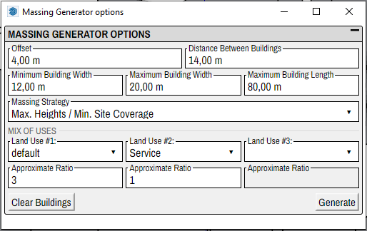

# Massing Generator

*Available in versions 2021.3.17 and higher*

Modelur offers a simple massing generator that can quickly populate existing [city blocks](../city_block) with buildings. The generator will randomly generate buildings on the selected *city blocks* so that the [Maximal permitted FAR](../city_block#city-block-limits) is achieved on each of the selected city blocks. The generated buildings will be of different dimensions and [land uses](../land_use). 

!!! note

    The solutions that the massing generator provides are randomly generated, so the quality of the design will vary greatly among different runs of the generator. Depending on the geometry of the city block, some absurd buildings might be generated. Especially on smaller city blocks, the target 
    value of Floor Area Ratio might not be achieved.

## Using the generator

#### From City Block tab

To generate buildings open the [City Block tab](../city_block), select the city blocks you want to populate and press *Generate* button:

When you press the button *Generate*. Modelur will populate the selected city blocks that are empty (without modelur buildings) so that the [maximal permitted FAR](../city_block##city-block-limits) for that city block will be achieved.

#### From Massing Generator Window

To open massing generator window select *Tools -> Massing Generator* from the [menu](../menu)

A new window with [generator options](#generator-options) and *Generate* and *Clear* buttons will be opened, where you can set the options and run the generator:

#### Generate Button

Clicking *Generate* button will run the generator. A warning will be issued if no city block is selected or if some of the selected city blocks are not empty.

#### Clear Button

When clicking the *Clear* button, the buildings will be deleted on all of the selected city blocks. A warning will be issued if no city blocks are selected or if the selected city blocks are not empty.

## Generator options

Select *Tools -> Massing Generator* in the [menu](../menu) to access the window with massing generator settings.

#### Setback and Distance

** Setback **

The distance of the generated buildings from the border of the city block. The default is 4m. If the value is 0, the buildings will be generated along the border of the city block. The value should be 0 or positive.

** Distance between buildings **

The distance between generated buildings will be precisely the specified amount. The default is 14m. The value should be positive.

#### Building Dimensions

** Minimum Building Width **

The width of the generated buildings will be larger that selected amount. The default value is 20m. The value should be positive.

** Maximum Building Width **

The width of the generated buildings will be smaller that selected amount. The default value is 20m. The value should be positive.

** Maximum Building Length **

In length of the generated buildings will be smaller than this amount. The default value is 80m.

#### Generator Strategy

The generator can cover different amount of area, depending on the selected strategy. We provide two strategies.

** Max. Heights / Min. Site Coverage **

The generator will try to achieve minimal site coverage.

To allow some variance in building heights, the site coverage will actually not be minimal possible. If the generator would cover the minimal amount of area, all of the generated buildings would have the [maximal allowed height](../city_block#city-block-limits). To avoid that, the achieved site coverage will not be the least possible for the [maximal allowed FAR](../city_block#city-block-limits), but it will be a bit higher.

** Min. Heights / Max. Site Coverage **

When using this strategy, the generator will cover as much area as it is permitted by the [Maximal Site Coverage](../city_block#city-block-limits). The average height of the buildings will therefore be minimal, but the generator will try to add at least some buildings of [maximal allowed height](../city_block#city-block-limits).
