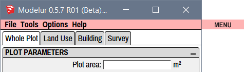
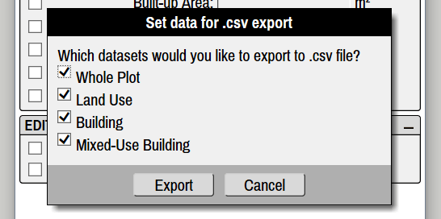
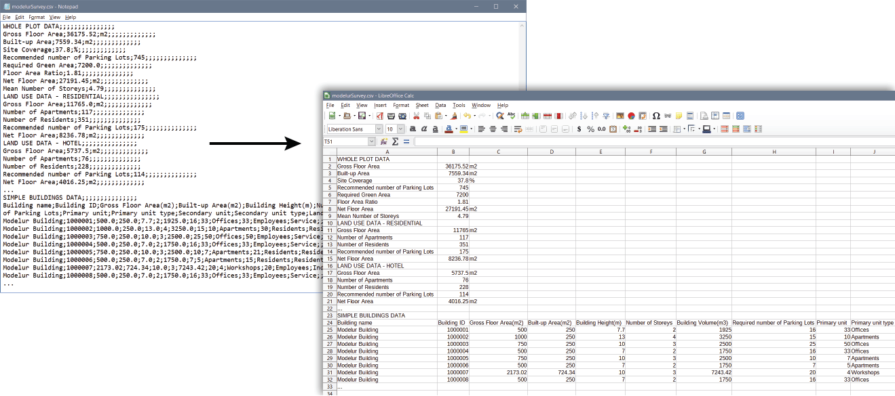
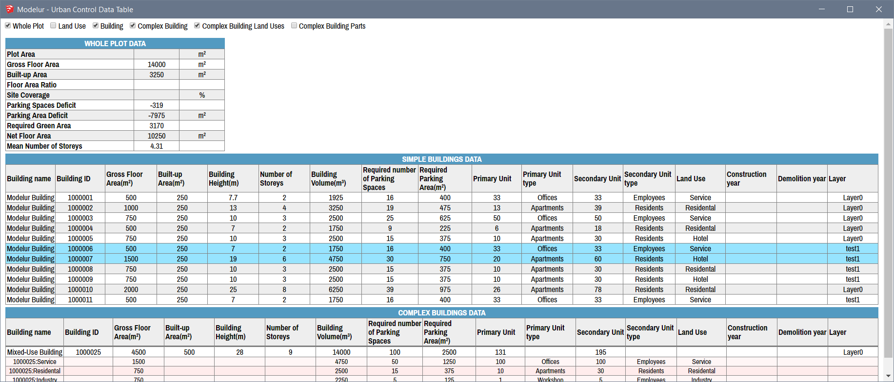

Menu is the topmost part of Modelur's user interface window (Figure 4.01). It contains four sub-categories: [File](#file), [Tools](#tools), [Options](#options) and [Help](#help), which are explained in detail below.

<figcaption>Figure 4.01 - Location of Modelur Menu.</figcaption>

File
----

Here you can open existing SKP files or export your data.

**File → Open**

Opens a dialog window that allows you to open existing SKP file.

**File → Export Urban Design Control Values…**

This is used to export urban control values (such as Gross Floor Area, FAR, Required number of parking lots, etc.) of currently opened model into CSV file. Before exporting the data, you have an option to choose which values you want to export (Whole Plot, Land Uses, Buildings, Complex Buildings). By default all options are selected for export (Figure 4.02).

For Complex Buildings, details about Land Use and/or each Simple Building from which it is constructed can be exported. Just select _Export also Land Use data
of Complex Buildings_ and/or _Export also Buildings that form Complex Buildings_.

<figcaption>Figure 4.02 - You can select which data you want to export to CSV file.</figcaption>

!!! hint "Sort Buildings by parameter value in CSV export"
    In case you have sorted the Buildings by some value in [Urban Control Data Table](#Tools), the order will be preserved when exporting the values to CSV file.
    
Exported CSV file can then be opened by any major spreadsheet software (eg. Excel, Google Sheets or LibreOffice Calc, Figure 4.03).

_Tip: When importing the data, make sure you have semicolon marked as separator sign in the spreadsheet software you are using._

<figcaption>Figure 4.03 - Example of urban control values exported to raw CSV file (left window) and imported to the spreadsheet software (right window).</figcaption>

Tools
-----

Here is a set of tools that help you work faster and more efficiently.

**Open Urban Control Data Table**

This will open a new, interactive Window with the complete urban control data of your model inside SketchUp (Figure 4.04). By clicking on the appropriate checkboxes at the top of this new Window, you can choose which sets of data are displayed (Whole Plot, Land Uses, Buildings, Complex Buildings ...). All values are refreshed in real-time and you can also use this Window to _select specific Buildings_.

<figcaption>Figure 4.04 - Urban Control Data Window displays all selected sets of data directly inside SketchUp.</figcaption>

By clicking on a (Complex) Building row in this Window, Modelur will select its counterpart inside the 3D Window. And vice versa - when you select the Building in 3D Window, it will get selected in the data table, too. Rows with selected Buildings are _marked with a light blue color_ (Buildings 1000006 and 1000007 in the image above).

If needed, (Complex) Buildings can also be _sorted by their values_. Simply click on the name of the column you want to sort by.

For Complex Buildings, details about Land Use and/or each Simple Building from which it is constructed can be shown. Just select _Complex Buildings Land Uses_ and/or _Complex Buildings Parts_ on top of the Window. These options are available for selection only if _Complex Building_ option is selected.

**Randomize Building Heights**

Using this functionality you can randomize selected Buildings number of storeys. Once Buildings are selected, click on this button and you will be presented with two options. If you select Absolute Number of Storeys all buildings will be randomized to number of storeys between min and max value. If you choose Relative Number of Storeys, selected Building's storeys will be randomized _based on their current Number of Storeys_ in the range between min and max values specified.

This option helps create dynamic urban solutions, avoiding too uniform look of the urban area.

**Create Terrain**

Modelur allows you to add texture to your buildings and/or landscapes. Select a surface, click on this tool and select a file with appropriate texture from your computer. Valid texture file formats are: .png, .jpg, .psd, .bmp, .tif and .tga.

**Calculate Sum of Selected Buildings**

Use this tool when you need to know the sum of Gross Floor Area and Built-up Area, Mean Number of Storeys, Parking Space Deficit for selected Buildings. Once Buildings are selected and you click this button, a temporary window will appear inside Modelur UI showing you all the numbers mentioned. Additionally, it will also show aggregated Gross Floor Area for selected Buildings by their Land Use including their ratio and number of selected Buildings (or Building Parts when selection includes Complex Buildings).

!!! hint "Updating Sum of Selected Buildings on the fly"
    Calculate Sum of Selected Buildings can also be done on-the-fly, as you select and deselect buildings if you turn on this option in [Urban Control Survey on Screen](survey#urban-control-survey-on-screen).

**Optimize Buildings for Google Earth**

Once your urban design proposal is finished, you might want to export it to geolocated KMZ file, which can be opened by many programs, including [Google Earth](https://www.google.com/earth/?target="_blank"). Using this feature Modelur will automatically optimize all Modelur Buildings by removing all unnecessary faces. If you want, you can also tell it to export floor Edges, so that the Building's storeys are visible inside Google Earth.  

Options
-------

Here you can select interface language, units and default building shape. Other options are described below:

**Buildings From Edges**

Tell Modelur if and how it should create Buildings or City Blocks when edges are selected. There are three options: _Don't Create_, _From One Edge_ and _From Edge Loop_.

_Don't Create_ option means you Modelur will create a Building or City Block only from selected faces, ignoring edge loops. If no face is selected, Modelur will create a Building in the middle of the coordinate system and with _Default Building Area_ (as defined in [Default Building Parameters](whole_plot/#default-building-parameters)).

 _From One Edge_ option means you can select just one edge of a closed loop and a Building or City Block will be created based on that loop. In case you have a loop within a loop and you select an edge of the outer loop, Modelur will create a Building/City Blocks based on the outer loop and ignore the inner loop (since it's edges are not in the selection). If you select edges in both loops, Modelur will create two objects - one in the inner loop and one from outer loop and hole in the position of the inner loop.

 _From Edge Loop_ option means you have to select ALL the Edges of a closed loop in order to create Building or City Block. Of no complete edge loop is selected, Modelur will ignore selected edges and create a Building in the middle of the coordinate system and with _Default Building Area_ (as defined in [Default Building Parameters](whole_plot/#default-building-parameters)) or switch to Line tool so you can draw new City Block.

**Calculate FAR Based On**

Tell Modelur whether you want to calculate Whole Plot's and City Blocks Floor Area Ratio based on Gross or Net Floor Area of Buildings. _By default this option is set to Gross Floor Area._

**Lock City Blocks Upon Creation**

Automatically locks City Blocks when they are created. This means a City Block can not be moved around the screen. This way you avoid accidentally moving a
City Block and spoiling your project.

If you do need to move a City Block, you can unlock it by right-clicking on the City Block and then selecting _Unlock_.

**Apply City Blocks LU Material**

Each City Block will be colored according to it's Land use (if the Land use has a specified color). You can specify a color for each Land Use in Land Use tab.

**Synchronize Land Use Panels**

Keep Land Use Panels between Input data and Survey tab in sync. This means the Land Use you select in _Land Use_ tab will also become selected (and displayed) in _Urban Control - Land Use_ section of the _Survey_ tab and the other way around.

**Show Status Bar**

Status Bar is located at the bottom of the User Interface. Status Bar shows short descriptions of Modelur options and functionalities when you hover over them.

**Show Building's Built-up Area**

Show built-up area face at the bottom of each Modelur Building.

**Mark Terraces and Loggias**

Apply green color to all Terraces and pink color to all Loggias. This way you can easily see how many Terraces and how many Loggias there are in your project.

**Sync Building's Layer**

If this option is turned on, Modelur will make sure that all Modelur Building's Entities (Edges and Faces) are placed on the same layer as the Building itself. The same is true for Complex Buildings and City Blocks. By default this option is turned on.

**Change Currency Symbol**

Opens up a dialog box for specifying new currency symbol. This currency symbol is shown in section _Investment calculation_ of the _Land use_ tab where
you define estimated price per square meter for Buildings with the chosen Land Use assigned. This enables Modelur to calculate estimated cost of the whole Building.

**Save Default Settings**

You can save your preferred settings combination as default by clicking on _Save Default Settings_. This settings will then be used every time you initialize new Modelur model.

**Restore Default Settings**

Reset Modelur to default settings. When applied please restart SketchUp and Modelur.

**Store Land Use changes**

When this option is checked, Modelur will save each Land Use change to temporary Land Use specifications file. Turn this feature on if you want to copy/paste Buildings and City Blocks with non-default Land Uses between different SKP models. The file `stored_land_uses.json`, is saved into your Modelur [Appdata folder](/getting-started/#modelur-location).

Help
----

Help section contains links to this User guide, Video tutorials, Modelur website and Modelur forum.

If you want to report a bug or send us a feature request, click on _Submit a Ticket_.

You can easily check for updates by clicking on _Check for Update ..._.

Enhancements and bugfixes included in your version of Modelur are displayed by clicking on _Changelog_.
