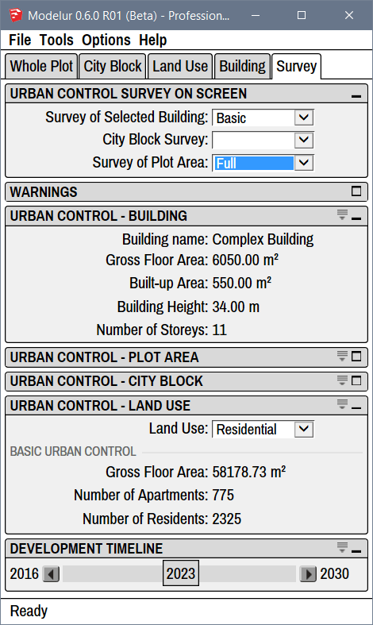
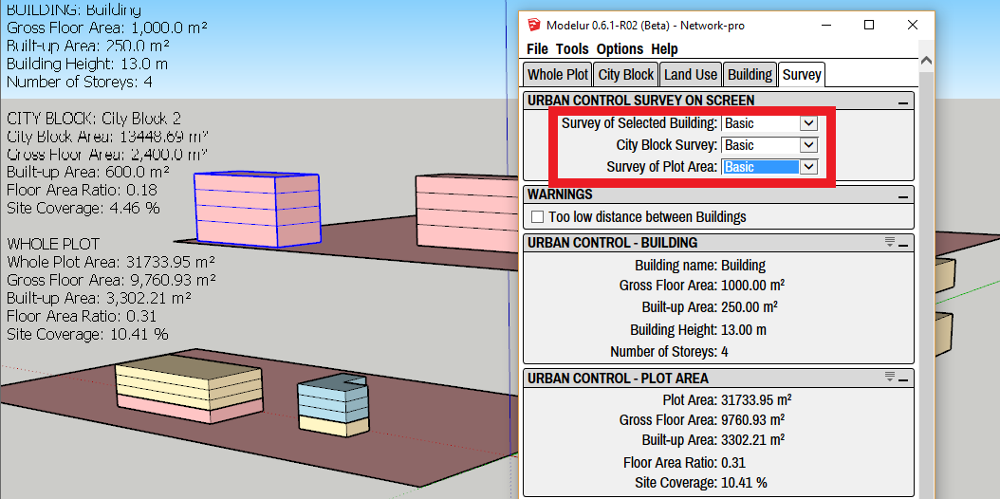

Survey tab is used to review current Urban Control Values of your project. Data is refreshed in real time, so any changes made to the model are instantly reflected. This is similar to the data table opened by _Tools → Open Urban Control Data Table_.

<figcaption>Figure 4.91 - Survey tab, which shows current Urban Control Values of the development.</figcaption>

!!! hint "Compact and Extended View"
    In case you don't see separators between parameters you can turn them on using the extend icon on the top right corner of each panel: .

Urban Control Survey on Screen
------------------------------

Current Urban Control Values can be displayed in Sketchup modelling area. All data displayed is refreshed in real time, so any changes made to the model are instantly reflected.

<figcaption>Figure 4.101 - Basic survey of selected Building, City Block and Plot Area shown in Sketchup modelling area.</figcaption>

**Survey of Selected Building**

You can choose between three options: _Blank_, _Basic_, _Full_ and _Sum of selected_. _Blank_ means no data are displayed in Sketchup modelling area.

_Basic_ option displays _Building name_, _Gross Floor Area_, _Built-up Area_, _Building Height_ and _Number of Storeys_.

_Full_ option displays all data included in the _Basic_ option as well as _Required Green Area_, _Required Parking Spaces_, _Required Parking Area_, _Building Volume_, _Net Floor Area_, _Assessed Investment_ and _Number of Primary and Secondary units_. [Primary and Secondary units](land_use#units) are defined in _Land Use tab_ for each Land Use type.

When _Sum of selected_ is chosen, Modelur will constantly sum up and display the total of all selected Buildings. It will show combined _Gross Floor Area_, _Built-up Area_, _Mean Number of Storeys_, _Required Green Area_, _Required Parking Spaces_, _Required Parking Area_, _Assessed Investment_ and _Sum of Gross Floor Areas of each Land Use_.

!!! tip "HeadsUp Display text"
    Sometimes the text that shows urban control values on screen is garbled. If this is the case, you can try selecting it (it's an actual SketchUp object) and change its size (and font) in SketchUp's Entity Info panel. 

**City Block Survey**

You can choose between three options: _Blank_, _Basic_ and _Full_. _Blank_ means no data are displayed in Sketchup modelling area.

_Basic_ option displays _City Block Name_, _City Block Area_, _Gross Floor Area_, _Built-up Area_, _Floor Area Ratio_ and _Site Coverage_.  

_Full_ option displays all data included in the _Basic_ option as well as _Green Area Deficit_, _Parking Spaces Deficit_, _Mean Number of Storeys_, _Net Floor Area_ and _Assessed Investment_.

**Survey of Plot Area**

You can choose between three options: _Blank_, _Basic_ and _Full_. _Blank_ means no data are displayed in Sketchup modelling area.

_Basic_ option displays _Whole Plot Area_, _Gross Floor Area_, _Built-up Area_,  _Floor Area Ratio_ and _Site Coverage_.  

 _Full_ option displays all data included in the _Basic_ option as well as _Green Area Deficit_, _Parking Spaces Deficit_, _Mean Number of Storeys_, _Net Floor Area_ and _Assessed Investment_.

Warnings
--------

**Too low distance between Buildings**

When checked, this real-time warning system will let you know if Buildings are placed too close together by coloring the misplaced Buildings in vivid red color. You can set the minimum distance parameters in [Plot Parameters](whole_plot/#distances) and in [City Block Parameters](city_block/#distances). Please note that this feature is quite computer intensive so you might want turn it off on older computers or when you don't need this information.

Urban Control - Building
------------------------

This section displays basic Urban Control Values of the selected Building. The same data is shown in Sketchup modelling area if _Basic_ is selected in _Survey of Selected Building_ in [Urban Control Survey on Screen](#urban-control-survey-on-screen) section.

Urban Control - Plot Area
-------------------------

This section displays basic Urban Control Values of the Plot area. The same data is shown in Sketchup modelling area if _Basic_ is selected in _Survey of Plot Area_ in [Urban Control Survey on Screen](#urban-control-survey-on-screen) section.

Urban Control - City Block
-------------------------

This section displays basic Urban Control Values of the City Block. The same data is shown in Sketchup modelling area if _Basic_ is selected in _City Block Survey_ in [Urban Control Survey on Screen](#urban-control-survey-on-screen) section.

Urban Control - Land Use
------------------------

This section displays _Gross Floor Area_ and _Number of Primary and Secondary units_ for the selected Land Use. [Primary and Secondary units](land_use#units) are defined in _Land Use tab_ for each Land Use type.

Development Timeline
--------------------

**Development Timeline** slider is used to show/hide Modelur Buildings based on their construction / demolition year. The range is automatically set to -1/+1 from the min and max construction / demolition year as [specified in Buildings](building/#selected-building-parameters). If no construction / demolition year is specified in any Building, span will be set to default as specified in [defaults.json](/getting-started/#preferences-location).

_Example: Say you have modeled 10 Buildings. You specified that the oldest Building in the model was built in 2010 and the newest will be built in 2025. Development Timeline will thus stretch from 2009 (min -1) to 2026 (max +1). If you then set one Building's demolition date to be in 2032, Development Timeline will update its span immediately from 2009 to 2033._

Using the slider you can easily move back and forth in time. Modelur will show only existing buildings at selected time (year) and recalculate all urban control values so they reflect chosen year's state only.
