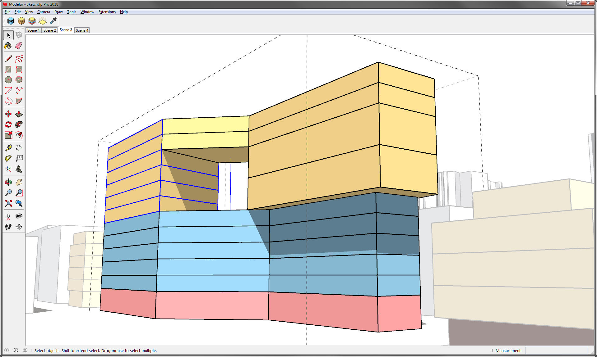

#### Initialize Modelur ####
Click on this button when you want to start Modelur and open user interface. In order to start Modelur you must be connected to the internet.

#### Create Building ####
This button will create simple Building (one Land Use type). If a face or a loop is selected, a building will be created based on its shape. If no face or loop is selected, Modelur will create a new Building based on [default Building parameters](whole_plot#default-building-parameters).

#### Create Complex Building ####
This button will create Complex (Mixed-use) building. Currently it is not possible for a user to change default parameters for a Complex Building.

Complex Building behaves as a group of Buildings (with different Land Use) on top of each other. You can edit Complex Building as a whole or each part separately. If you want to edit Complex Building as a whole, select the whole Complex Building by clicking on it. It's parameters will be displayed in the [Building tab](building) where you can edit them.

If you want to edit only part of a Complex Building, mark the whole Complex Building as a group by double clicking on it first, then select part of the Complex Building by clicking on it once. Parameters of that part will be displayed in the [Building tab](building) where you can edit them.

<figcaption>Figure 5.01 - Whole Complex Building is selected as a group (dotted line). Inside this group a part of Complex Building
is selected (blue line). This part can now be edited (for eg. Land Use changed) in Building tab.</figcaption>

#### Create City Block ####
Select a polygon or closed planar edge loop and click on this button to create Modelur City Block. You can edit a City Block in [City block tab](city_block).

#### Sync City Block Parameters ####

Synchronize City Block Parameters Tool is used to easily transfer Parameter values from one City Block to another. This Tool is available via _Modelur Toolbar_ (picker icon) or by clicking on the [Sync button](city_block/#buttons) inside _Modelur User Interface → City Block → Selected City Block Parameters_. Alternatively, if some City Blocks are already selected, you can activate this tool also via _Context Menu Modelur → Sync City Block Parameters_.

If City Blocks are already selected, this Tool will apply the Parameters from the picked City Block to all selected City Blocks (marked with yellow dashed outline). If no City Blocks are selected, you first need to pick source City Block (one from which Parameters will be transferred). Source City Block is marked with yellow outline. Then click and hold ++ctrl++ key, which will change the Tool icon from picker to injection. When you click on some other City Block with injection turned on, it will receive the parameters from the source City Block.

When there are some City Blocks in selection while this Tool is active, you can press ++esc++ to deselect them. Note that this will only deselect City Blocks and no other SketchUp Entities in your selection.

Using Sync City Block Parameters you will transfer both, City Block and its Building Parameters, which in turn will also affect all Buildings placed on the City Block to which Parameters are being transferred (according to their [Parameters hierarchy](/quickstart/#step-3-changing-the-parameters)).
