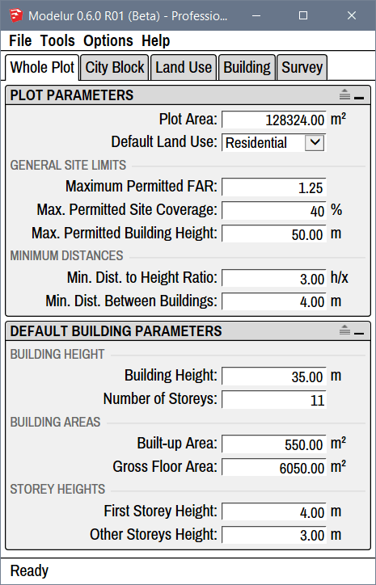
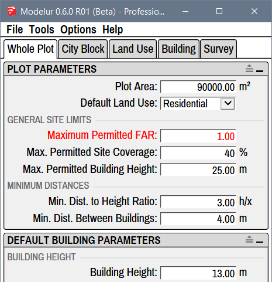

Under the Whole Plot tab (Figure 4.21) you can define default Zoning constraints 
and Building Parameters that are applied throughout the development area if not 
specified otherwise. To understand how Parameters work inside Modelur, please 
visit [Parameters hierarchy explanation](../../quickstart/#step-3-changing-the-parameters).

<figcaption>Figure 4.21 - Whole Plot tab, which shows the default Parameters 
for the whole development area. If the Parameter in <a href="../city_block">City Block</a> 
or <a href="../building">Building</a> is not overloaded, the values defined here will be used.</figcaption>

!!! hint "Compact and Extended View"
    In case you don't see separators between parameters you can turn them on 
    using the extend icon on the top right corner of each panel: 
    .

Plot Parameters
---------------
Inside the Plot Parameters panel you can define default parameters that are 
valid for the _whole development area_ unless they are overloaded by specific [City 
Blocks](../city_block).

**Plot Area**

Plot area represents the size of the _whole development area_. This parameter is 
used to calculate Floor Area Ratio (FAR = Gross Floor Area/Plot Area) and Site 
Coverage (Built-up Area/Plot Area) of the whole development area.

In case you have any [City Blocks](../city_block) defined, Modelur will automatically 
sum up their areas and display it here (and also use it in calculations). However, 
if you want you can overload sum of City Block's areas by simply entering the 
area size of your choice. If you then prefer to use calculated value instead, 
just delete your specified area size and Modelur will set it back to sum of City Blocks.   

**Default Land Use**

Using default Land Use _dropdown menu_ you can set the default Land Use for 
City Blocks and Buildings. Land Uses are used to calculate Building's units 
(eg. apartments, residents, offices, etc), parking requirements, green area 
requirements, etc. To learn more about these settings, please visit [Land Use 
section](../land_use) of this page.

#### General Site Limits ####

Under General Site Limits you can set the default constraints set by zoning ordinance
 so that Modelur can warn you if they are exceeded. But it will not prevent you from 
 exceeding them.

In case your development model exceeds set Zoning Constraints, they will 
become red, to warn you about it (Figure 4.22). 
Once the model is fixed to meet constraints again (or when zoning ordinance 
constraints themselves are updated), exceeded parameters will turn back to black. 
These parameters can also be set for each [City 
Block](../city_block/#selected-city-block-parameters) separately. When 
defined on City Block level, they are valid only for that City Block (including 
the Buildings Heights).

<figcaption>Figure 4.22 - When text color in Modelur user interface turns red,
 the Parameters in question are exceeded.</figcaption>

**Maximum Permitted FAR**

Using maximum permitted Floor Area Ratio you can define allowable FAR for the 
whole development area. In case FAR value for the Whole Plot is exceeded, this 
line will become red, to warn you about it. If you don't want Modelur to 
validate achieved FAR, simply erase this value and hit ++enter++.

**Max. Permitted Site Coverage**

Using maximum permitted Site Coverage you can define allowable Site Coverage 
for the whole development area. In case Site Coverage value for the Whole 
Plot is exceeded, this line will become red, to warn you about it. If you 
don't want Modelur to validate achieved Site Coverage, simply erase this 
value and hit ++enter++.

**Max. Permitted Building Height**

Using maximum permitted Building Height you can define height restrictions 
for the whole development area. In case some Building is higher than specified 
here, this line will become red, to warn you about it. If you don't want 
Modelur to validate Buildings Heights, simply erase this and hit ++enter++.

#### Distances ####

**Percentage of Building Height:**

Percentage of Building Height is used to calculate minimum distance between 
two Buildings based on their heights. Example: if this parameter is set to 
50% and Building is 20 meters high, the minimum distance required will be 
10 meters (which is 50% from 20 meters).

_Deprecated: In versions of Modelur prior to 2018.1, this option was named 
Min. Distance to Height Ratio. To calculate distance, the Building's height 
is divided by the parameter value. Example: if parameter is set to 2, the 
minimum distance will be 1/2 of Building's height, if set to 3, it will be 
1/3 of Building's height. If the Buildings are placed closer than the 
calculated distance, they will be marked red (assuming that [Too low distance 
between Buildings](../survey/#warnings) is active)._

**Min. Dist. Between Buildings**

Minimum distance between Buildings is the absolute distance (in meters 
or feet) between any two Buildings. If the Buildings are placed closer 
than this specified distance, they will be marked red (assuming that [Too low 
distance between Buildings](../survey/#warnings) is active).

Default Building Parameters
---------------------------
Default Building Parameters inside the Whole Plot tab are the topmost 
Building parameters in [Modelur's 
hierarchy](../../quickstart/#step-3-changing-the-parameters). This means that if 
the parameter in question is not 
[defined by the Building itself](../building/#selected-building-parameters) 
(or any object in it's hierarchy, eg. [City Block](../city_block)), 
Modelur will apply the values defined here to the Building. For example, when 
you create a new Building, it will contain number of storeys, Land Use, etc 
as defined here.

#### Building Height ####

**Building Height**

Building height sets how tall should the Building be in chosen units (metric 
or imperial). When changing Number of Storeys, First Storey Height and 
Other Storey Heights this parameter will adapt itself automatically.

**Number of Storeys**

Number of storeys sets the number of Building's storeys. When you change 
this parameter, Building Height (described above) will be adapted 
automatically to reflect calculated height based on Number of Storeys and 
First and Other storeys Height (described below).

#### Building Areas ####

**Built-up Area**

Built-up area sets the default floor area size of the Building. Please note 
that this value will be automatically overloaded when creating the Building 
(to keep drawn floor area size) unless you check the Manually drawn floor 
plan assumes default Built-up Area under Building tab → Editing Modes of 
Building. Built-up Area will automatically be adapted if you change Gross 
Floor Area (described below) to match the division of Gross Floor Area with 
Number of Storeys.

**Gross Floor Area**

Gross floor area parameter is used to define default gross floor area size 
of the Building. If Building is created from scratch (no horizontal SketchUp 
Face is selected), this will be used to determine size of the Building (in 
combination with Number of Storeys).

#### Storey Heights ####

**First Storey Height**

First storey height is used to set the default height of Building's ground 
floor. Changing this parameter will change default Building Height, too.

**Other Storeys Height**

Other storeys height is used to set the default height of all Building's 
storeys above ground floor. Changing this parameter will change default 
Building Height, too.
